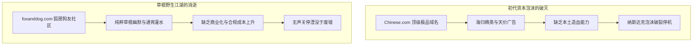

在中文互联网狂飙突进的三十年里，无数曾经风光无两的千亿巨头与明星社区轰然倒下，化为赛博废墟。从千禧年拨号上网时代的草根论坛，到移动互联风口下的资本狂欢，科技浪潮冲刷出了一座座“互联网公墓”。

然而，在这片废墟边缘，却有极少数不起眼的垂类网站，不靠大厂输血、不盲目追逐风口，硬生生穿越了 PC 到移动端、再到算法推荐的数轮周期。复盘这段兴衰史，不仅是对一代网民青春的打捞，更是对数字社区生存本质的冷酷审视。

---

### 一、 时光网 vs 豆瓣：垂直社区的商业化岔路

在中文影视评论领域，时光网（Mtime）与豆瓣的命运分野，是垂直社区商业化路径选择的教科书级对照。

```text
+-------------------------------------------------------------------------+
|                         垂直影视社区的生死岔路                           |
+-------------------+-----------------------------------------------------+
| 时光网 (Mtime)    | 转向营销门户 -> 错失选座风口 -> 押注衍生品 -> 被收购边缘化|
+-------------------+-----------------------------------------------------+
| 豆瓣 (Douban)     | 坚持书影音纯粹性 -> 拒绝售卖评分区 -> 沉淀不可替代公信力   |
+-------------------+-----------------------------------------------------+
```

1. **时光网的溃败路径**：
   - **丢弃影迷基本盘**：2008 至 2012 年，早期的时光网凭借精美的排版、硬核的电影资料库与深度影评，在影迷群体中的专业度一度压过豆瓣。然而，为了追求上市与广告变现，时光网主动削弱社区功能，转型为影视资讯与营销门户，充斥公关通稿，导致核心影迷大规模出走。
   - **错失移动选座风口**：2012 年移动端爆发，猫眼、淘票票等平台背靠资本大打“9.9 元票价补贴战”，迅速建立“手机端查影讯+在线选座”的闭环。时光网反应迟缓，空有海量资料库却沦为无变现场景的静态工具。
   - **商业化押错衍生品**：2015 年前后，时光网将核心资源押注在正版电影周边与线下实体店，而在当时国内衍生品消费习惯远未成熟的背景下，高成本直接拖垮了现金流。
   - **被收购后的工具化阉割**：2016 年被万达院线以 2.8 亿美元全资收购后，时光网沦为院线宣发附庸，核心的全球电影节奖项库、历史票房统计等特色模块被大面积阉割。
2. **豆瓣的“克制”护城河**：
   - 相比之下，豆瓣的“慢”与对商业化的极度克制反而构筑了护城河。多年来，豆瓣坚决不将评分系统与核心评论区变为可明码标价的广告位。这种对社区氛围的偏执守护，使其成为中文互联网极少数穿越周期、依然具备行业公信力的书影音评价集散地。

---

### 二、 社交巨头的死因解剖：猫扑与人人网的战略自残

如果说时光网死于商业化转型的误判，那么猫扑（Mop）与人人网（校内网）的倒塌，则是被资本绑架与战略摇摆的典型产物。

1. **猫扑：成于大杂烩，死于低俗化**
   - 作为初代网络流行语的策源地（BT、YY、27149 等），早期的猫扑依靠严格的邀请制与积分（MP）体系汇聚了第一代高智商网民。
   - 2004 年被千橡互动收购后，为了迎合上市大举开放注册、强行推进流量变现，导致水军泛滥、垃圾广告横行，核心创作者迅速流失。
   - 2012 年将运营团队从北京迁往长沙，彻底切断了与互联网核心圈的联系。在 PC 末期，猫扑依靠擦边标题党榨取最后一波流量，当新浪微博以碎片化和名人效应崛起时，已经低俗化的猫扑瞬间丧失了存在价值。
2. **人人网：一手好牌被打得稀烂**
   - 2011 年在纽交所上市时市值达 74 亿美元的人人网，曾手握全中国最纯粹的大学生真实社交关系链。
   - 其战略自残始于改名：为了从校园扩圈至社会白领，强行将“校内网”更名为“人人网”，直接稀释了同学实名关系的纯粹性；
   - 面对 2011 年微信的崛起，人人网手机客户端体验臃肿不堪；更致命的是管理层的“万能插座”式跟风——在社交基本盘动摇时，盲目转向二手车、互联网金融、美女直播乃至区块链（RRCoin），每一次跟风都在洗劫仅存的老用户，最终将校园社交圣地折腾成四不像。

---

### 三、 初代神站与草根江湖：从 Chinese.com 到狐朋狗友

回溯 2000 年前后的互联网蛮荒时代，还有一众名字深刻印在初代网虫的记忆中：



- **Chinese.com 的域名泡沫**：在千禧年 Dot-com 泡沫期，拥有 `Chinese.com` 意味着天然坐拥全球华人互联网超级入口。然而，拿着海外千万美元风投的精英团队缺乏中国本土“泥腿子”的地面执行力，在内容运营与电信增值业务（SP）变现上完败于本土三大门户，泡沫破灭后迅速沦为停靠广告的域名墓碑。
- **河北第一门户 `inhe.net`（网际银河 / 银河网）**：创立于 1997 年的正牌河北官方门户，以电信/广电背景成为全省政民互动与资讯第一站，后演化为 `yinhewang.cn`。
- **纯草根神站 `foxanddog.com`（狐朋狗友社区）**：在天涯与贴吧崛起前的真空期，这个独立社区以极致粗粝、荤素不忌的野生幽默和“纯粹灌水”文化，成为无数通宵网吧少年的精神寄托，最终在监管合规收紧与无变现能力的现实中静默关闭。

---

### 四、 幸存者的“低维生存法则”

在天涯停摆、猫扑人人衰亡的背景下，**恩山无线论坛（Right.com.cn）**、**吾爱破解（52pojie）**、**NGA 玩家社区** 展现出了惊人的生命力。总结这些老牌网站的生存哲学，可以提炼出三条核心法则：

| 核心法则 | 具体表现 | 典型代表 |
| :--- | :--- | :--- |
| **1. 极度的克制与门槛** | 主动拒绝迎合大众流量，通过邀请码、答题机制或极高技术门槛过滤低质用户，不盲目追求虚假繁荣。 | 吾爱破解、早期 NGA |
| **2. 无法复制的图文资产** | 沉淀了十几年经过验证的底层固件（OpenWrt/Padavan）、逆向工程技术或精品游戏攻略，在搜索引擎中占据不可撼动的权重。 | 恩山无线论坛、吾爱破解 |
| **3. 低维冬眠与轻量运营** | 维持极小的团队规模与极低的服务器运营成本（如坚守经典的 Discuz! 架构），没有外部资本对赌与财报压力，随时具备“就地冬眠”熬死对手的能力。 | 恩山无线论坛 |

### 结语

互联网的演进往往被描绘为算力与算法的狂飙，但社区的本质是**人性的契约**。

那些被资本裹挟、频繁更换赛道、将用户视为变现干电池的巨头最终灰飞烟灭；而那些守住极客精神、甘愿维持“低维生存”的小众乌托邦，反而成了时代洪流中最坚固的礁石。
