回顾过去数十年的科技商业史，从千亿市值的巨无霸到分崩离析的废墟，巨头的起落往往被笼统归结于“技术迭代”或“市场变迁”。然而，当我们剥开资本运作与公关辞令的表象，将目光聚焦于关键十字路口的核心决策时，会发现一个冰冷而残酷的共性：**起家往往伴随野蛮掠夺，守成依赖时代趋势，而毁灭几乎全部归咎于平庸傲慢的管理层与内部内耗。**

### 一、 微软 2008 战略复盘：被防御性思维错失的十年

2008 年，微软曾开出 446 亿美元天价要约试图全面收购雅虎（Yahoo）。在当时的微软管理层眼中，雅虎是抗衡 Google 搜索广告帝国的唯一解药。然而，站在历史长周期的终局回看，这恰恰是典型的防御性短视。

如果当年的微软拥有跨时代的战略格局，它最应该收购的标的绝非雅虎，而是 **Sun Microsystems** 与 **AMD**：

1. **收购 Sun：提前十年拥抱开源与 Linux**
   - 微软在鲍尔默时代将 Linux 称为“癌症”，倾尽全力推广 .NET 试图绞杀 Java，结果导致长达十年的开发者生态大分裂。
   - Sun 拥有 Java、Solaris（UNIX）、ZFS 文件系统以及早期的容器技术（Zones）。如果微软在 2008 年将 Sun 收入麾下，不仅能让 Windows Server 与 Java 生态深度融合、统治企业级后端，更能在 2008 年直接打造出 Linux 子系统（WSL），根本无需等到 2016 年才被迫转向“微软爱 Linux”。同时，这也将从底层彻底封死后来 Google 借用 Java 打造 Android 生态的窗口。
2. **收购 AMD：打破 Wintel 枷锁，提早实现芯片自主**
   - 2008 年的 AMD 恰好完成了最关键的蜕变——剥离了重资产晶圆制造业务（格芯 GlobalFoundries），转型为纯芯片设计公司（Fabless）。
   - 相比作为“美国国家战略资产”且背负沉重晶圆厂包袱的 Intel，无晶圆厂的 AMD 是微软最理想的芯片设计中枢。若效仿苹果收购 P.A. Semi 的路径吞下 AMD，微软不仅能直接掌控 Xbox 芯片底座，更能提前十五年为 Surface 与 Azure 云计算定制自研 CPU/GPU，从而免去在移动端被功耗拖垮、在 AI 时代被算力供应商制约的被动局面。

然而，彼时的微软沉浸在 Windows 与 Office 的垄断暴利中，决策层满脑子是用雅虎去争夺存量搜索流量，最终错失了提前布局开源底层与芯片自研的黄金十年。

### 二、 资本架构与控制权博弈：反向收购与 VIE 终极底牌

谈及雅虎，不得不提其商业史上最富戏剧性的一笔投资：2005 年与阿里巴巴的资本重组。

#### 1. 交易架构的本质：阿里反向收购雅虎中国
大众常误以为这是“雅虎 10 亿美元投资阿里”，但从严谨的公司金融与资产重组角度来看，**这是一场由阿里巴巴主导的反向兼并**：
- **交易代价**：阿里巴巴增发新股，将 40% 的股权交予雅虎；
- **收购标的**：阿里巴巴全资兼并“雅虎中国”的全部资产、技术团队与品牌运营权（包括雅虎搜索、一搜、3721 及中文邮箱）；
- **现金补差**：为平衡 40% 股权与雅虎中国实际资产之间的估值差额，雅虎额外向阿里注资 10 亿美元现金。

马云借此一役获得了击溃 eBay 所需的充沛资金与搜索算法储备（日后演化为阿里妈妈），而雅虎中国品牌则在兼并后逐步退出历史舞台，雅虎自此退化为单纯的财务投资人。

#### 2. 控制权大于投票权：支付宝剥离风波的底层逻辑
2011 年围绕支付宝股权剥离引发的软银、雅虎与阿里三方控制权争夺战，揭示了跨国资本博弈的深层铁律：**在绝对的本土行政监管红线面前，海外离岸公司的名义投票权只是一张纸，实际公章与协议控制权才是底牌。**

面对央行关于第三方支付牌照外资准入的硬性规定，马云利用本土法定代表人与实际运营控制人的绝对权力，果断终止 VIE 协议并将支付宝转入纯内资公司。华尔街与海外股东虽在程序上强烈抗议，但在既成事实与本土牌照门槛面前，海外投票权无法跨越物理辖区，最终只能选择妥协并签署补偿协议。

### 三、 巨头起家的原罪与施乐 PARC 的“终极猪队友”

科技史上并不存在道德圣人。无论是硅谷巨头还是早期中国互联网企业，草莽时代的原始积累往往带有野蛮甚至灰色的印记：

- **硅谷巨头的二次创新**：微软 Windows 与苹果 Macintosh 的图形界面（GUI）与鼠标交互，源头均来自于施乐（Xerox）帕罗奥多研究中心（PARC）。乔布斯用 Pre-IPO 股票换取参观门票，盖茨则借助为 Mac 开发软件的契机融会贯通。两者虽然扮演了“硅谷海盗”，但其伟大之处在于将实验室内的昂贵玩具重构为走进千家万户的个人电脑。
- **施乐管理层的灾难范式**：施乐拥有全人类顶尖的科学家与先驱技术（GUI、以太网、激光打印机），却拥有商业史上最平庸的管理层。高管们被复印机和碳粉的暴利蒙蔽双眼，将颠覆时代的计算机原型弃如敝履，不仅以 100 万美元微利让出技术参观权，更以冷漠官僚逼得科学家出走创办了 Adobe、3Com 等传奇企业。

### 四、 戴尔 vs IBM/惠普：创始人独裁与职业经理人陷阱

在 PC 与企业级计算的转型浪潮中，戴尔（Dell）、IBM 与惠普（HP/HPE）的命运分水岭，再次印证了领导力与治理结构的决定性作用。

```mermaid
graph TD
    subgraph 戴尔模式: 创始人强权与长期豪赌
        D1[2013 私有化退市] --> D2[排除华尔街短期财报干扰]
        D2 --> D3[2015 670亿美元收购 EMC/VMware]
        D3 --> D4[2024-2026 AI算力服务器全球霸主]
    end
    subgraph IBM模式: 官僚文化与PPT咨询
        I1[提出智慧地球概念] --> I2[缺乏通用底层产品]
        I2 --> I3[沦为昂贵定制外包与PPT咨询]
        I3 --> I4[Watson医疗大败退与云计算掉队]
    end
    subgraph 惠普模式: 频繁内耗与战略自残
        H1[111亿美元盲目收购Autonomy] --> H2[巨额减记与管理层内讧]
        H2 --> H3[切香肠式拆分为 HP 与 HPE]
        H3 --> H4[业务陷入微利与平庸]
    end
```

1. **戴尔：创始人强权下的前卫逆袭**
   - 迈克尔·戴尔在 2013 年顶住压力将公司私有化退市，彻底切断华尔街短视资金对转型的干扰；随后以 670 亿美元“蛇吞象”收购数据中心与存储巨头 EMC。正是这一提前八年的战略布局，使戴尔在 2024-2026 年这轮 AI 服务器（搭载英伟达 GPU）军备竞赛中，瞬间跃升为全球供应链最为成熟的核心算力供应商。
2. **IBM 与惠普：职业经理人与财务数字的诅咒**
   - **IBM** 早在 2008 年便提出“智慧的地球”，2011 年推出认知计算 Watson，但因高管层深陷财务报表考核与销售顾问导向，未能将先发技术沉淀为公有云基础设施或通用开发者平台，最终将概念演化为昂贵低效的定制外包项目，在公有云和现代大模型浪潮中接连失守。
   - **惠普** 则在李艾科等频繁更换的 CEO 治下，经历了以 111 亿美元收购涉嫌财务造假的 Autonomy 案等一系列自杀式决策，最终在内耗中被动拆分，沦为平庸的代名词。

### 五、 商业底层的四条铁律

总结这一段跨越数十年的商业兴衰史，可以提炼出四条恒定的商业运行法则：

1. **技术不等于商业，产品的封装与统治力才是王道**：用户不为发明者买单，只为成熟的产品经理买单。施乐与 Sun 创造了底层技术，但红利最终被善于商业闭环与产品化的捕手掠走。
2. **在趋势面前，规模与资金一文不值**：当时代范式发生迁移（x86 与开源替代专用小型机、推荐算法替代人工门户），死守旧有印钞机的巨头将在瞬间被瓦解。
3. **实际控制权压倒名义投票权**：无论离岸资本如何设计，真正掌握本土法人、公章、团队与牌照准入的一方，在极端博弈中拥有不可逆的最终话语权。
4. **成功由时代与运气铸就，失败往往纯粹源于人祸**：千亿帝国的崩溃，往往始于握着方向盘的管理层的平庸、自负与团队内耗。
