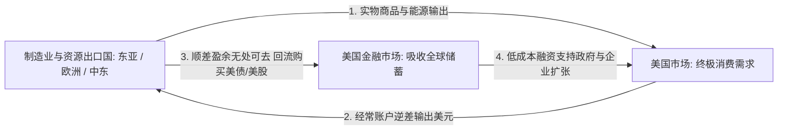

在探讨当今国际金融秩序时，“全世界都在供养美国：美国印钞买商品，顺差国买美债，美债再支撑美国继续消费”是一个广为流传的通俗观点。

这种直觉虽然敏锐地捕捉到了资本与实物的单向流动表象，但在严谨的宏观经济学框架下，这并非单向的“吸血”，而是一个**由全球分工、贸易结算、安全资产供给与资本回流共同驱动的“全球经济大循环闭环”**。

---

### 一、 全球经济大循环：商品、货币与资产的三重对流

将全球宏观经济运行机制抽象化，可以清晰地还原出三大要素的闭环流动：



根据宏观经济恒等式：**经常账户逆差 ≡ 资本账户/金融账户净流入**。

1. **商品流（全球 → 美国）**：东亚制造国与中东资源国向美国输出高性价比实体商品与能源，维持美国居民的高消费与相对低通胀；
2. **货币流（美国 → 全球）**：美国通过每年数千亿美元的贸易逆差（经常账户逆差）向全球注入美元流动性；
3. **金融资产流（全球 → 美国）**：出口国赚取庞大美元外汇后，无法直接在本土大量使用，必须寻找高流动性、安全且有收益的美元资产进行保值。因此，这笔资金最终通过购买美国国债、企业债、美股及房地产，重新回流美国金融体系。

**美国实际上在向全球出口“美元计价的高流动性金融资产”，而全球则向美国出口“真实的实物商品与劳动力”。**

---

### 二、 美日发债模式的本质差异：内循环 vs 全球融资

同为高负债发达经济体，日本与美国在国债的消化与融资机制上呈现出根本不同的底层逻辑：

```text
+-------------------------------------------------------------------------+
|                         美日国债融资模式对比                            |
+-------------------+-----------------------------------------------------+
| 日本模式 (JGB)    | 日本政府发债 -> 日本央行 (43%+) + 国内银行/保险消化 (内循环) |
+-------------------+-----------------------------------------------------+
| 美国模式 (UST)    | 美国财政部发债 -> 全球顺差国储备 + 跨国机构投资者消化 (全球循环) |
+-------------------+-----------------------------------------------------+
```

- **日本的“内循环借贷”**：日本国债（JGB）超 85% 以上由日本国内金融体系（央行、养老基金、商业银行、保险公司）持有。其本质是日本政府向日本居民与机构借用日元储蓄，外部溢出与主权违约风险极低。
- **美国的“全球蓄水池”**：美国国债是由全球金融体系共同承接的储备资产。日本（持债超 1.1 万亿美元）、中国以及欧洲机构投资者是其核心海外持有者。美国借的是全球最重要的储备货币，享有“超级特权（Exorbitant Privilege）”，因此能长期维系财政与经常账户的“双赤字”而免于传统新兴市场的外汇枯竭危机。

---

### 三、 美元帝国的“三位一体”资产层（三座大山）

大众口中所谓的“三座大山”，本质上是同一个美元资本帝国的三位一体架构：

| 资产层级 | 功能定位 | 核心运作逻辑 | 对全球的“双刃剑”效应 |
| :--- | :--- | :--- | :--- |
| **美元 (USD)** | **血液层**（计价与结算） | 全球贸易、大宗商品计价与跨境清算基础设施 | **铸币税与加息收割**：美联储通过加息/降息周期，引发非美经济体资本外流与汇率动荡。 |
| **美债 (UST)** | **水库层**（信用与无风险基准） | 全球金融机构的无风险收益率锚（Risk-free Rate）与安全资产底座 | **虹吸储蓄与债务稀释**：吸收全球剩余储蓄为美国财政买单，以通胀长期稀释持债国购买力。 |
| **美股 (US Equities)** | **引擎层**（高收益权益资产） | 汇聚全球顶尖资本，推动 AI、半导体与前沿科技创新 | **估值霸权与流动性吸附**：美股虹吸全球活跃资金，导致非美市场长期面临流动性不足与估值折价。 |

这三者相互强化：全球赚取美元 → 配置美债获取安全收益 / 配置美股获取创新增长 → 资金回流美国推动企业利润与财政扩张 → 催生更多美元资产。

---

### 四、 循环体系的收益、代价与潜在黑天鹅

这一看似完美的经济大循环并非没有代价，各参与方在享受红利的同时亦背负着沉重的代偿：

#### 1. 参与方的收益与代偿
- **美国**：
  - *收益*：拥有以纸质信用换取全球实物的特权与资产定价权；
  - *代价*：本土实体制造业不可逆的空心化，以及受特里芬难题（Triffin Dilemma）制约的不可持续债务雪球。
- **顺差制造国**：
  - *收益*：依托美国终极消费市场拉动工业化与数以亿计的制造业就业；
  - *代价*：顺差利润长期被美元通胀稀释，并被动承担美联储货币政策的外溢冲击。

#### 2. 未来可能引发循环断裂的“黑天鹅”
1. **美债利息雪球与信用基石动摇**：美国国债利息支出持续攀升，若市场开始怀疑其“无风险”属性，美债收益率飙升将直接重创美股估值与美元信誉。
2. **日元套利交易（Carry Trade）剧烈平仓**：长期以近乎零成本借入日元、投向海外高息美元资产的数万亿美元套利资金，一旦遭遇日本央行被迫加息，将引发全球流动性的瞬间休克。
3. **去美元化与双边本币结算**：随着多国央行持续增持黄金储备并推进非美元双边贸易结算，流入美债水库的全球储蓄边际放缓，将从根本上削弱“借债消费”闭环的可持续性。

---

### 结语

全球经济大循环不是童话，也不是单纯的掠夺，而是一套高度精密且各取所需的全球契约。

认识到“美元是血液、美债是水库、美股是引擎”的三位一体逻辑，才能在纷繁复杂的国际地缘金融动荡中，把握全球资产定价与资本流动的终极脉搏。
