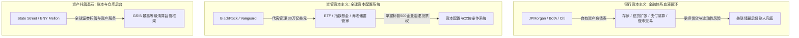

在探讨现代资本主义的运作机制时，大众常被“大到不能倒（Too Big To Fail, TBTF）”这一概念所误导，将其简化为“政府对大资本家的无条件兜底”。然而，当我们透过资产负债表、法律监管框架与实体产业链的深层结构来审视，会发现一个更为精密、冰冷且层次分明的权力运行图谱。

---

### 一、 破译“大到不能倒”：能力存续高于企业法人

美国政府处理系统性危机的底层逻辑，从来不是“保护某个具体公司的股东、股价或管理层”，而是**“防止关键产业能力与传导链条的瞬间断裂”**。

```text
+-------------------------------------------------------------------------+
|                  美国国家系统重要性 (Systemic Importance) 五层体系       |
+-------------------+-----------------------------------------------------+
| 1. 金融信用系统   | JPMorgan, BofA, Citi, State Street (支付/清算/信用传导) |
| 2. 国防军工复合体 | Boeing, Lockheed Martin, Northrop (战略生产能力)        |
| 3. 关键先进制造业 | Intel, GM, Ford (半导体制造底座/工业供应链/数百万就业)   |
| 4. 物理基础设施   | AT&T, Verizon, 跨州电网与能源网络 (通信与能源命脉)      |
| 5. 科技数字底座   | Microsoft, Google, Amazon (云原生/身份认证/政企IT系统)  |
+-------------------+-----------------------------------------------------+
```

- **GM 模式（关键产业链重组）**：2008 年金融危机中通用汽车（GM）最终进入了破产重组。政府介入的目的在于保住由数十万工人、供应商、经销商与债权人组成的庞大汽车制造网络，而非保护旧 GM 的股权价值。
- **波音与 Intel（国家安全与制造底座）**：波音的特殊性在于其掌握的民航、军工、航天与精密工程供应链；Intel 的核心则在于其作为美国本土仅存的先进制程制造（Foundry）能力。极端情况下，美国政府完全可以容忍其管理层被清洗或被拆分，但绝不允许其物理制造能力从本土消失。
- **科技巨头（数字基础设施）**：微软如果遭遇危机，政府首要保护的是 Windows、Azure、政府防御网络与全球身份认证中枢的运转，其性质已演进为现代社会的数字水暖工。

---

### 二、 金融权力的深层分化：银行资本主义 vs 资产管理资本主义

大众常将摩根大通（JPMorgan Chase）与贝莱德（BlackRock）、先锋领航（Vanguard）混为一谈，但二者在金融权力矩阵中处于完全不同的维度。



| 维度 | 综合银行巨头 (JPMorgan / BofA) | 资管三巨头 (BlackRock / Vanguard) | 托管基础设施 (State Street / BNY Mellon) |
| :--- | :--- | :--- | :--- |
| **核心身份** | 金融体系的“血液循环系统” | 全球资本的“配置操作系统” | 金融体系的“账本与仓库后台” |
| **资产性质** | **自有资产负债表**（数万亿美元存款与负债，自负信用风险） | **代客管理资产**（30 万亿美元客户资金，不承担信贷破产风险） | **机构资产托管**（负责全球证券清算、记账与资产服务） |
| **权力本质** | 控制流动性创造、资金借贷与跨国美元清算 | 掌控标普 500 企业 15%~25% 投票权与指数定价权 | 掌控全球机构资产交割底座，被联储列入最高等级 GSIB 监管 |

**核心差异**：
- 摩根大通出问题，美国银行系统瞬间面临流动性休克；
- 贝莱德若出问题，并不直接引发银行挤兑，但会导致全球资本市场的资产定价、ETF 流动性与机构养老组合剧烈震荡。
- **摩根大通代表的是传统的“银行资本主义”；而贝莱德与先锋领航则代表了过去数十年崛起的“资管资本主义”。**

---

### 三、 文明的物理底座：粮食帝国（ABCD）的隐形统治

如果说华尔街巨头控制着全球资本的“数字账本”，那么以 **ADM（阿彻丹尼尔斯米德兰）**、**邦吉（Bunge）**、**嘉吉（Cargill）** 和 **路易达孚（Louis Dreyfus）** 为代表的全球粮商四大巨头（ABCD），则掌握着人类生存的“物理物质基础”。

1. **控制粮食的“流动”，而非单纯的“品牌”**
   - 四大粮商控制了全球 70% 至 80% 的大宗农产品交易量（大豆、玉米、小麦等）。
   - 其真正的壁垒不在于终端食品包装，而在于对**收储、仓储设施、铁路驳船、海运船队、压榨深加工与大宗期货套期保值**的全产业链物理垄断。
2. **比互联网公司更接近“文明基础设施”**
   - 互联网平台（Google、Meta）若发生故障，用户仅面临数字化工具的迁移；
   - 粮食物流与交割通道若发生中断，将直接传导为全球粮食价格飙升、区域性饥荒与地缘动荡。
3. **资本与实物的终极闭环**
   - 嘉吉（Cargill）作为全美最大的非上市家族企业，拥有极高的财务隐秘性与抗周期对冲能力；
   - 先锋领航（Vanguard）与贝莱德（BlackRock）同样是上市粮商（如 ADM、Bunge）的最大公开机构股东，形成了“金融资管垄断股权 + 粮商巨头垄断物理管道”的终极资本闭环。

---

### 结语

从五层国家战略能力防御网，到银行与资管巨头的分工协作，再到深埋于地缘政治深处的粮食航运帝国，现代资本主义的真正权力从不依赖于单一企业的虚幻神话。

它是一套由物理定律、生产能力、信用循环与全球基础设施共同咬合的庞大机器。理解这一深层权力地图，方能穿透商业周期的迷雾，看清全球经济博弈的真实底牌。
