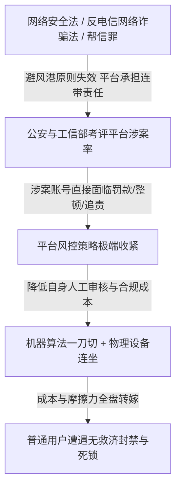

在当下的数字生活中，普通用户几乎都经历过某种荒谬的时刻：在一台常用电脑上登录了一个沉睡老号，结果整台设备上登录过的所有账号被连带降权或登出；换绑了海外手机号，却在解封时被要求进行“系统内根本没有身份证底版”的人脸识别，陷入无法前进也无法后退的死锁死循环。

这类令人抓狂的体验，并非孤立的技术故障，而是**平台在法律监管高压、成本转嫁与商业接口垄断三重驱动下，演化出的一套极端激进的“数字连坐与免责暴力”体系**。

---

### 一、 微信风控的微观机制：设备污染与人脸死锁

微信（WeChat）的风控强度在业内以“歇斯底里”著称。其底层依赖一套极其严密的多维指纹追踪矩阵：

```text
+-------------------------------------------------------------------------+
|                        微信多维设备指纹与连坐链路                       |
+-------------------+-----------------------------------------------------+
| 硬件指纹提取      | 网卡 MAC 地址 + 硬盘序列号 + 主板 UUID + 注册表残留 |
+-------------------+-----------------------------------------------------+
| 行为连带惩罚      | 沉睡号/异地 IP 在该 PC 登录 -> 整机设备指纹被标记为高风险 |
+-------------------+-----------------------------------------------------+
| 身份验证死锁      | 无实名账号触发人脸识别 -> 无底版可比对 -> 陷入无限报错死循环|
+-------------------+-----------------------------------------------------+
```

1. **设备指纹的全局污染**：
   - 微信桌面端会深度读取网卡 MAC、硬盘物理序列号及系统注册表。当一个长期未登录的“低权重号”或使用代理 IP 的账号在某台 PC 上登录时，风控引擎会直接将该设备判定为“黑灰产号商阵地”，从而对该物理设备上的**所有关联账号实施全局降权或强制重新认证**。
2. **换绑海外号的逻辑死锁**：
   - 国内注册的微信账号即使后续换绑海外手机号，若未曾上传中国大陆身份证进行实名认证，一旦遭遇环境风控，系统仍会机械地要求调用公安人脸数据库进行刷脸验证。由于后台根本不存在比对模板，直接导致账号陷入**“无法刷脸验证，又无法绕过验证”的死循环**。

---

### 二、 为什么平台会演变出“极端自保”？

为什么平台宁可承受海量普通用户的抱怨，也要采取“宁可错杀一万，绝不漏网一人”的防御姿态？



1. **避风港原则失效与“帮信罪”高压**：
   - 在早期的互联网法律中，“避风港原则（Safe Harbor）”保护平台免受用户侵权行为的连带责任。然而在当下的《反电信网络诈骗法》及刑法“帮信罪”（帮助信息网络犯罪活动罪）框架下，平台若对涉诈、黑灰产行为“应知而未采取有效措施”，需承担直接的行政处罚甚至刑事连带责任。
2. **免责式执法与 KPI 传导**：
   - 监管部门对平台的涉案率与拦截率实行严格的指标化考评。对腾讯而言，封错一千个普通用户的公关成本，远低于因放过一个黑灰产账号而招致监管约谈和业务停顿的合规风险。算法因而被赋予了极致的惩罚性权重。

---

### 三、 全球主流平台风控体系横向对照

不仅是微信，全球主要科技巨头在风控逻辑上均展现出不同程度的冷酷性，但受制于不同法域，其表现形态各异：

| 平台 | 核心风控逻辑 | 典型惩罚机制 | 用户救济机制 |
| :--- | :--- | :--- | :--- |
| **微信 (WeChat)** | 强实名库绑定 + 硬件/IP 多维连坐 | 设备指纹污染、强制人脸识别死锁、好友辅助验证 | 极度依赖自动化，人工客服通道深度隐藏且响应缓慢 |
| **YouTube (Google)** | **主体级人头封禁（Circumvention）** | 针对运营主体而非单个频道，通过 AdSense/IP/邮箱矩阵批量清除名下所有子频道 | 自动化拒信率极高，申诉往往需要借助 X 等公开舆论施压 |
| **Telegram** | 反垃圾 Bot 自动化扫描 | 频繁加群或私信即被挂上“Scam/Spam”标签，限制主动发言 | 申诉 Bot（@SpamBot）近乎无人维护，人工审核极度匮乏 |
| **WhatsApp (Meta)** | 纯手机号 + IMEI 封锁 | 针对群发与非官方客户端秒封设备 IMEI 与 IP，但不涉及人脸死锁 | App 内一键提交申诉或邮件联系，相对容易解封 |
| **欧盟 GDPR / DSA** | **“比例原则”法治约束** | 严禁无边界滥用人脸识别，平台必须证明风控措施与风险对等 | **强制要求提供透明、易达的人工复核通道** |

---

### 四、 风控模型的本质祛魅：不是深奥智能，而是利益与摩擦力

很多时候，平台将这套机制包装为高大上的“AI 智能风控模型”，但拆解其底层，本质往往是极其简陋的规则堆叠：

1. **粗暴的规则链与 if-else**：所谓风控大脑，很大一部分是硬编码的敏感词过滤、正则表达式、IP 归属地对比与固定的操作频次阈值，根本不具备上下文理解能力。
2. **人为制造摩擦力与垄断接口**：
   - 平台严打自动化脚本与多开工具，名义上是“防范黑灰产”，实质上是**为了维护自身 UI 的点击率、广告曝光以及对 API 接口的商业垄断**。
   - 冗长的图形验证码、强制手机扫码与人脸比对，其核心作用是人为制造操作摩擦力，通过消耗用户的时间成本来达到低成本防刷的目的。

---

### 结语

在中心化平台的权力天平上，普通用户的数字权利早已被置于平台自我免责与商业利益的绝对下游。

从微信的人脸死锁到 YouTube 的连带强平，数字世界的治理困境揭示了一个现实：当代码成为法律、算法成为法官，而用户失去了对等博弈与人工救济的渠道时，技术便利的背后，是一座由制度性内耗筑起的数字围城。
