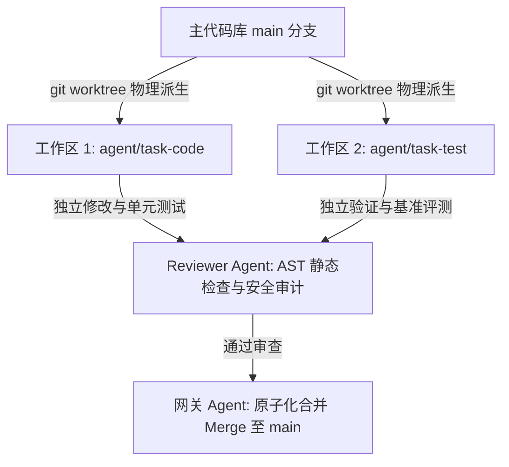
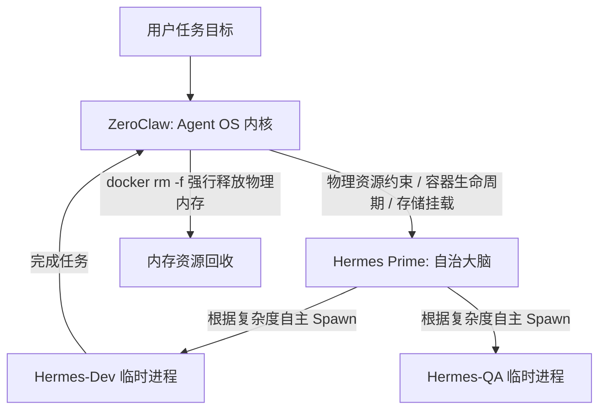

当前的 AI Agent 领域正处于一种“疯狂囤积拼图”的狂热期。从 LangGraph 到 AutoGen，开发者们沉迷于尝试各种编排框架，试图复现那种“CEO 智能体下令，员工智能体干活”的直觉模式。

然而，作为深耕分布式架构的技术人，必须泼一盆冷水：**这种简单的“包工头”模式在面对真实生产环境时几乎注定失败**。

如果你还在纠结如何写更长的 System Prompt 来让 Agent 乖乖听话，或者在为 API 账单心惊肉跳，那么你可能错过了多智能体协作中真正关键的工程底座。

我们要讨论的，是如何从“Agent 堆砌”转向“Agent 控制平面（Control Plane）”的工程进化。

---

### 真相一：别再保存聊天记录了，你需要的是“技能蒸馏”

很多架构设计者陷入了一个极其昂贵的误区：将长达万级的 Token 聊天记录（Chat History）作为上下文反复透传。这不仅导致调用成本飙升，还会让模型陷入“Lost in the Middle”的注意力溃散困境。

```text
+-------------------------------------------------------------------------+
|                  上下文堆叠 vs 技能蒸馏 (Skill Distillation)            |
+-------------------+-----------------------------------------------------+
| 错误模式 (高开销) | 每次任务加载 10,000+ Token 历史会话 -> 易迷失且昂贵  |
+-------------------+-----------------------------------------------------+
| 正确模式 (低开销) | 成功轨迹 (Trace) -> 提炼标准 Script/Tool -> 零背景消耗|
+-------------------+-----------------------------------------------------+
```

**记住：一个优秀的程序员不会每天重新学习 Nginx。**

一个成熟的 Agent 系统不应沉迷于保存原始对话，而应实现“技能蒸馏（Skill Distillation）”。当执行 Agent（如 Hermes）成功完成了一次复杂的部署任务后，系统应将其执行轨迹进行摘要提炼，去粗取精，固化为一个标准工具。

你的架构中必须存在一个 `/skills` 数据库，其核心 Schema 应当包含：
- **`id`**：技能唯一标识；
- **`name`**：技能名称（如 `deploy_nextjs_app`）；
- **`input_schema`**：结构化的输入参数定义；
- **`execution_script`**：提炼后的标准 Python/Shell 脚本或 DSL；
- **`success_rate`**：该技能在历史执行中的成功率评分。

这种做法能让单次任务的 Token 消耗从上万降至近乎零，执行延迟从十秒级降至毫秒级。

---

### 真相二：物理隔离是协作的底线——引入 Git Worktree

在代码生成或复杂系统修改场景中，如果多个 Agent 共享同一个本地工作目录，那简直是工程灾难。写冲突、状态脏污染以及无法回滚的操作会让系统迅速崩盘。

多 Agent 协作需要回归软件工程最基本的底座：**物理隔离**。



与其在代码层面修修补补，不如直接利用 `git worktree` 为每个 Agent 分配独立的物理沙盒。一套严谨的协作流程应当如下：
1. **派生工作区**：通过 `git worktree add -b <branch-name>` 为每个任务创建独立物理目录与分支；
2. **并发试错**：不同的执行 Agent 在各自的工作区并行修改代码、运行单元测试，互不干扰；
3. **评审合并**：Reviewer Agent 检出该分支进行 AST 静态检查和安全性审计，确认无误后最终通过网关 Agent 合并（Merge）至主干。

这种基于物理工作流的原子性保障，才是多智能体大规模协作的工程基础。

---

### 真相三：成本控制的艺术——模型阶梯降级

“全员顶级大模型（如 GPT-4o / Claude 3.5 Sonnet）”不仅是土豪行为，更是架构上的懒政。在商业化落地中，高效系统必须学会**“模型阶梯降级（Model Cascade）”**。

```text
[规划与审计层 (Planner / Auditor)]
└── 动用顶级模型 (Claude 3.5 Sonnet / o1 / R1): 负责逻辑拆解、安全边界划定与最终结果校验

[执行与操作层 (Worker)]
└── 降级至低成本端侧小模型 (Qwen-2.5 7B / Gemini Flash) 或本地纯代码脚本: 处理整理 README、修改 CSS、执行构建
```

数据证明，这种阶梯式路由能实现 **80% 以上的成本降低**，并带来 5~10 倍的吞吐量提升。别再浪费昂贵的推理资源去处理那些通过 Regex 或简单脚本就能搞定的琐事了。

---

### 真相四：架构的终极演进——从“编排器”到“Agent OS 内核”

这是认知的分水岭。在诸如 RK3568（4 核 Cortex-A55, 2-8GB 内存）这种资源极度受限的边缘硬件环境中，系统根本承担不起臃肿的中间件与复杂的消息总线。

此时，像 `zeroclaw` 这样的编排器不应扮演“CEO（认知者）”，而应回归其本质：**Agent OS 内核（Kernel）**。



- **核心原则：权力归还**：编排器（内核）必须彻底剥离微观决策权，专注处理资源隔离、进程生命周期管理、存储挂载和安全沙箱；
- **大脑归位**：将认知权完全还给主 Agent（如 Hermes Prime）。由主 Agent 根据任务复杂度自主实现动态派生（Spawn）子节点，而内核只负责在内存告警或系统 OOM 时执行 Kill/Restart 动作。

这种“控制权”与“认知权”的物理分离，是系统长效运行不崩盘的唯一保证。

---

### 真相五：无状态容器 + 有状态内核 = 真正的自进化

如何解决“Agent 容器销毁后，学到的经验就丢失”的问题？答案是实现“执行”与“状态”的物理脱钩。

我们采用**“任务结束即销毁容器”**的极简策略，以确保系统环境永远清爽、无垃圾残留。而所有的“进化”都发生在宿主机挂载卷上。

```text
+-------------------------------------------------------------------------+
|                  无状态容器与有状态内核的数据闭环                       |
+-------------------------------------------------------------------------+
| 销毁的是 Container (挥发性内存 RAM) —— 保持系统极简纯净                 |
| 保留的是 Memory & Skill (持久化硬盘 NVMe) —— 沉淀数字智力资产           |
+-------------------------------------------------------------------------+
```

```text
[任务启动] ──> ZeroClaw (Kernel) 读取宿主机 /skills 目录，拉起干净容器
                   │
[任务执行] ──> Hermes 在沙箱中思考并执行任务，自动提炼新 Skill 脚本
                   │
[任务完成] ──> 新提炼的 Skill 实时写回宿主机持久化卷 /kernel_shared/skills/
                   │
[物理销毁] ──> 触发 docker rm -f 抹除临时容器，内存完全归还系统
                   │
[继承进化] ──> 下一个新容器启动时自动挂载最新技能库，实现能力的复利增长
```

通过宿主机目录映射，我们将 Agent 生成的每一个成功脚本、每一份评估报告实时写回持久化层。Agent 哪怕被销毁了一万次，它的智力资产也在持续累加。

---

### 前瞻总结与思索

未来 AI 竞争的焦点将不再是“谁创建了 Agent”，而是**“谁拥有更高效的 Agent 运行平台（Agentic Control Plane）”**。

回看这五个真相：
1. **技能蒸馏** 解决了上下文膨胀与执行效率；
2. **Git Worktree** 解决了并发修改冲突；
3. **模型阶梯降级** 解决了商业化成本；
4. **内核演进** 解决了解耦与资源管理；
5. **无状态容器** 保障了系统的自进化能力。

最后，留下一个值得所有技术人深思的问题：

> **如果 AI 已经学会了自己生成工具、提炼技能并管理同伴，那么人类在这一套“Agent OS”中，最终该扮演内核的底层开发者，还是最高规则的制定者？**
