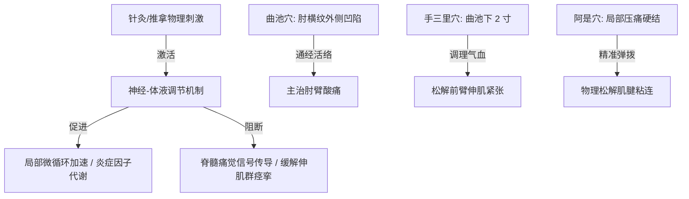

在长期伏案、高频敲击键盘与使用鼠标的程序员与极客群体中，“手腕酸痛、前臂胀痛、肘关节外侧针刺般疼痛”是极高发的职业顽疾。这类症状常被简单归类为“网球肘”（肱骨外上髁炎）。

然而，许多极客的网球肘在经历了局部热敷、涂抹消炎药膏后依然反复发作，其根源往往在于：**这不是单纯的肌肉劳损，而是一条由“颈椎错位压迫 -> 肌肉代偿 -> 前臂肌腱退行性病变”构成的生物力学病理链条**。

本文结合现代人体工学、生物力学与中医经络学说，系统复盘如何进行极客身体力学的彻底自救。

---

### 一、 溯源：网球肘与“假性网球肘”的生物力学链条

肱骨外上髁炎（网球肘）本质上是控制手腕背伸的“伸腕肌群”在反复高张力拉扯下，导致附着在肘关节外侧骨头上的肌腱产生微小撕裂与无菌性炎症。

对于键盘/鼠标过度使用的人群，其致病路径通常可分为两类：

```text
【传统型网球肘】
鼠标摆放过远/手腕悬空 -> 前臂伸肌腱长期被迫过度发力 -> 局部肌肉过度负荷与肌腱退化

【神经激惹型（假性网球肘）】
显示器高度低/长期探头 (科技颈) -> 颈椎 C6/C7 关节微错位 -> 压迫神经根 -> 沿手臂放射至肘部
同时引发手臂肌群代偿性紧张 -> 诱发肱骨外上髁肌肉无力与疼痛
```

**为什么调理好后依然可能复发？**
人体关节骨骼的排列依赖周围肌群力量的动态平衡。即使通过中医正骨或理疗暂时解除了颈椎压迫，如果日常依然维持旧的“低头耸肩”办公坐姿，且没有主动训练上背部肌群（如斜方肌中下束、菱形肌），颈椎椎体会在韧带松弛的状态下重新微错位，再次压迫神经，导致网球肘卷土重来。

---

### 二、 祛魅：中医腧穴针灸与伤科手法机制

在中医传统医学中，网球肘归属于“肘劳”范畴。针灸与推拿手法是临床上公认见效最快的非手术手段：

#### 1. 腧穴的本质与取穴逻辑
中医的“穴位（腧穴）”并非凭空虚构，现代解剖学证实其高度重合于神经末梢、微血管丛及结缔组织相对密集的敏感区域。



- **曲池穴**（手阳明大肠经）：屈肘成直角，肘横纹外侧端凹陷中。是消除肘关节局部湿热、通经活络的主穴；
- **手三里穴**（大肠经）：曲池穴下 2 寸。对前臂肌肉酸痛、肌力衰减有极强调节作用；
- **阿是穴**（压痛点）：重点针对压痛硬结进行垂直于肌纤维方向的轻柔弹拨，能物理松解肌腱组织与周围包膜的无菌性粘连，促进组织灌注。

#### 2. 自动康复与力量重建
急性期过后，防止复发的核心在于**“离心力量训练”**：
- **伸腕肌群拉伸**：伸直手臂，掌心向下，用另一手将患侧手背向下扳，感受前臂上方拉伸感，保持 15–30 秒；
- **手腕离心放低**：前臂平放桌面，手握轻量哑铃，用健康侧手帮助抬起手腕，然后由患侧手腕**极其缓慢地（用时 3–5 秒）**放低哑铃。每次 10–15 次，每日 2–3 组，能显著提升肌腱纤维的刚性与抗拉张能力。

---

### 三、 实战：极客人体工学办公环境改造指南

要想从根本上切断“颈椎错位”与“前臂劳损”的恶性循环，必须对办公桌椅及外设进行力学微调：

#### 1. 高度基准：桌子过高是怂恿耸肩的罪魁祸首
打字或使用鼠标时耸肩，会使斜方肌持续紧绷，直接导致肩颈劳损与颈椎神经压迫。

```text
【黄金高度法则】
1. 坐在椅子上，双肩自然放松下沉，大臂垂直于躯干。
2. 小臂抬起，与大臂呈 90°~100° 的略微向下舒展角度。
3. 调整椅子或桌面高度，使键盘和鼠标的表面高度刚好与此时的小臂高度平齐。
* 如果桌子无法调矮，调高椅子并增加脚踏；或者加装桌下负倾角键盘托盘。
```

#### 2. 位置布局：拒绝伸手远够
手臂向前伸展过远，会给前臂伸肌腱与斜方肌带来持续性的静力拉伸。
- **键盘居中**：键盘的主键区（G/H键）必须对准身体的胸骨中线；
- **收起键盘脚架**：传统键盘脚架升起会强迫手腕向上折弯（背伸），大幅增加肌腱压力。**应平放键盘，甚至采用前端高、后端低的负倾角打字**；
- **推荐短配列键盘**：使用 80% 或 60% 无数字小键盘的短键盘，能极大地缩短右臂外展去够鼠标的距离，让鼠标处于中立活动区；
- **肘部支撑**：小臂的 1/3 到 1/2 应平稳放置在可调节座椅扶手或桌面上，分担肩部压力。

```text
[不规范布局 (高风险)]
桌子过高 + 键盘脚架撑起 + 鼠标偏远悬空 --> 耸肩、手腕折弯、前臂紧绷 --> 诱发颈椎压迫与网球肘

[人体工学布局 (安全保护)]
桌椅齐肘 + 键盘收起脚架/平放居中 + 垂直鼠标靠近 + 肘部有扶手支撑 --> 双肩自然下沉、手腕平直
```

#### 3. 握持设备：引入垂直鼠标
普通鼠标强制手腕呈水平状态，使前臂的尺骨与桡骨呈交叉状态，挤压周围肌腱。

更换为**垂直鼠标（Vertical Mouse）**或轨迹球，能让手腕呈现自然的“握手”姿势，使前臂骨骼呈平行状态，从根本上释放肌腱张力，并强迫你使用大臂或肩部发力移动鼠标，保护手腕。

---

### 结语

身体的疼痛是一个警示信号，提示你当前的力学力线已出现偏差。

通过中医正骨和针灸解除急性的“神经压迫”与“局部无菌性粘连”，配合长期的“上背部肌肉强化”与“人体工学办公环境改善”，才能彻底跳出网球肘反复发作的泥潭，恢复持久的生产力。
