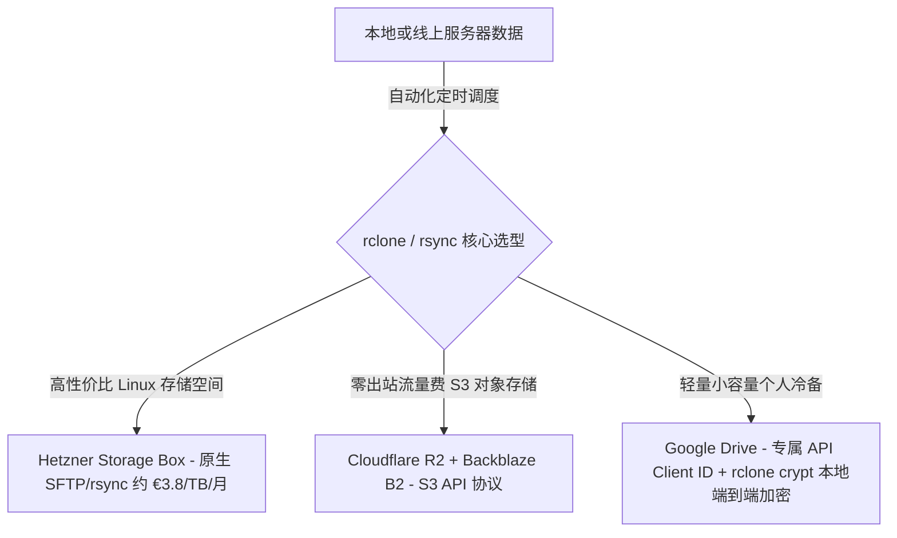

在数字化资产（代码、影视、个人照片、数据库与服务器配置）日益膨胀的当下，如何构建一套兼顾**容量、成本、自动化同步与绝对数据主权**的存储备份方案，是每个极客与技术从业者绕不开的命题。

从商业网盘的花式套路，到 CLI 工具链（rsync / rclone）的自动化整合，再到自建私有 NAS 的经济学账本，本文将系统梳理极客数据存储与分层备份的完整方法论。

---

### 一、 商业云盘的定位分水岭与套路解构

大众常将所有云存储统称为“网盘”，但在产品设计逻辑上，它们存在根本性的生态分水岭：

```text
+-------------------------------------------------------------------------+
|                         商业云存储的三大产品流派                        |
+-------------------+-----------------------------------------------------+
| 传统生产力同步盘  | Dropbox, OneDrive, iCloud (昂贵/强实时协同/严苛 Hash 审查)|
+-------------------+-----------------------------------------------------+
| 大容量消费资源盘  | 115网盘, 阿里云盘, PikPak (便宜/磁力秒传/易遭 API 封禁)    |
+-------------------+-----------------------------------------------------+
| 海外套壳出海盘    | TeraBox (百度网盘出海版/1TB免费诱饵/广告限速变现套路)    |
+-------------------+-----------------------------------------------------+
```

1. **TeraBox 的公关包装与真实血统**：
   - 官方宣传中强调的“日本东京总部、硅谷高管团队”实为合规出海包装。其前身为 2020 年百度日本子公司（PopIn）推出的 DuBox，后因海外数据审查与地缘合规切割至日本空壳公司 Flextech。
   - 其商业模型完全继承了百度网盘的基因：以“免费送 1TB”作为诱饵吸引海量大文件存入，随后通过严重的非会员限速、密集的弹窗广告、解压收费与单文件体积限制进行变相变现。
2. **为什么老牌同步盘不适合“量大管饱”？**
   - **Dropbox / OneDrive** 的核心是双向实时同步、历史版本追溯与文档协同，其容量定价极高（Dropbox 2TB 约 $120/年）。
   - 更致命的是**版权 Hash 主动审查机制**，在云端扫描到敏感影视或破解资源极易导致整个主账号（连带工作文档）被直接封禁。

---

### 二、 极客自动化备份（rsync / rclone）的黄金选型

对于需要结合命令行（CLI）进行服务器与本地自动化备份的场景，必须放弃消费级网盘，转向支持标准协议（S3 / SFTP / WebDAV）的底层存储节点：



#### 1. 性价比首选：Hetzner Storage Box
- **协议支持**：原生支持 rsync、rclone、SFTP、WebDAV 与 SMB；
- **成本与体验**：1TB 约 €3.8/月，5TB 约 €12.6/月，不限流量。提供原生 Linux Shell 交互，可直接通过 `rsync -avzP` 保留文件权限与软链接，无需任何中间 API 转换。

#### 2. 公有云对象存储（S3 协议）：Cloudflare R2 与 Backblaze B2
- **Backblaze B2**：存储单价约 $0.006/GB/月，前 10GB 免费；
- **Cloudflare R2**：**0 出站流量费（0 Egress Fee）**，提供 10GB 免费存储。配合 `rclone crypt` 在本地完成高强度端到端加密后再推送到云端，云端服务商仅能看到无意义的加密分块。

#### 3. Google One / Drive 踩坑与避坑指南
- **750GB/天上传硬顶限制**：首次进行全量初始化同步时必须添加 `--bwlimit 8M` 进行速率限制，否则中途会触发 `403 Quota Exceeded` 截断任务；
- **必须创建专属 Google API Client ID**：直接使用 rclone 默认共享 ID 在高频处理海量碎文件时会频繁遭遇 `403 User Rate Limit Exceeded`，在 Google Cloud Console 免费创建私有凭据后即可彻底解决限流问题。

```sh
# rclone 端到端加密备份至对象存储的最佳实践命令
rclone sync /data/docker-apps gdrive-crypt:backup/docker-apps \
  --fast-list \
  --tpslimit 10 \
  --transfers 4 \
  --checkers 8 \
  -P
```

---

### 三、 自建 NAS 的 5 年经济学账本与分层策略

当个人或团队的数据积累跨过 10TB~20TB 节点后，自建私有 NAS 在吞吐性能、综合成本与数据主权上构筑了压倒性优势。

#### 1. 成本与周期对比（以 80TB 裸容量 / 约 48TB 有效可用为例）

| 方案 | 初始与订阅成本 | 5 年综合支出 (含电费/换盘) | 核心痛点与限制 |
| :--- | :--- | :--- | :--- |
| **自建 NAS (4×16T 企业盘)** | 硬件与硬盘约 9,000~11,000 元 | **~13,000 元** | 硬件故障需自行维护，有初始组装与网络门槛 |
| **Google One (30TB)** | 约 1,200 元/月 | **~72,000 元** | 价格随容量呈线性暴涨，长期持有成本极高 |
| **国内商业网盘 SVIP** | 约 300~500 元/年 | **~2,500 元** | 虚假容量：非标准 API、限速限频、隐私扫描严重 |

#### 2. 自建 NAS 的硬件防坑与风险规避
- **严禁购买叠瓦盘（SMR）**：组建 RAID 阵列必须选用 CMR 垂直记录企业盘（如希捷银河 Exos 或西数 HC550，带 5 年质保）；
- **UPS 不间断电源是刚需**：NAS 硬件损坏与阵列崩塌 80% 源自劣质电源或突发断电，配置一台带 USB 通信断电自动关机功能的 UPS（约 300~400 元）至关重要。

---

### 四、 GitHub 私有库备份的边界与误区

利用 GitHub 备份数据时，必须清晰界定其能力边界：

- **绝杀场景（纯文本与代码）**：个人代码、Docker Compose 配置、Dotfiles 以及 Obsidian Markdown 笔记（配合 `obsidian-git` 实现秒级静默同步），享受 GitHub 顶级的高可用与版本历史回溯；
- **巨大误区（大文件与切片上传）**：试图通过将照片或视频切片成 10MB 分块强行 Push 到私有仓库，严重违反 GitHub《服务条款》（Acceptable Use Policy）。不仅会遭遇单个 Repo 超 1GB 的容量警告，更会因被判定为“滥用代码托管作为网盘 CDN”而面临直接封号风险，且数据恢复链条极其脆弱。

---

### 五、 极客数据分层备份（3-2-1 架构）

结合上述所有工具与介质，最稳健的数据拓扑如下：

```text
[Tier 1: 海量冷数据 / 影视影音]
└── 存放介质: NAS 本地大容量 RAID 阵列 (内网 2.5G/10G 高速访问，损坏可重新获取)

[Tier 2: 核心文档 / 数据库 / 个人照片 / 密钥]
├── 本地端: NAS RAID 阵列 + 本地离线移动硬盘定期冷备
└── 云端异地: 通过 rclone crypt 自动加密同步至 Cloudflare R2 / Hetzner Storage Box

[Tier 3: 核心生产力代码 / Markdown 知识库]
└── 托管介质: GitHub 私有库 (原生 Git 历史回溯 + 分支保护)
```

### 结语

存储工具没有绝对的高下，只有场景的精准匹配。

将代码交予 Git，将海量冷数据交予本地企业盘 NAS，将核心加密增量交予标准 S3 协议对象存储，是抵御商业平台规则变更、保障数字资产长治久安的终极解法。
