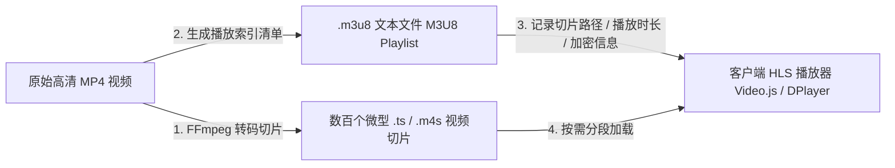

在现代 Web 与社交媒体平台（如 X / Twitter）的内容分发中，如何实现“高清流畅播放”的同时，防止视频源文件被爬虫批量抓取、跨站盗链或被普通用户一键下载，是流媒体工程的核心命题。

从传统的整段 MP4 直链到基于 **HLS（HTTP Live Streaming）** 的切片流媒体协议，配合反向代理与动态加密鉴权，工业界建立起了一套严密的防盗链技术护城河。

---

### 一、 HLS 视频切片的底层流式机理

传统的单一 `.mp4` 文件分发存在两大硬伤：
- 客户端必须加载完整的视频元数据（moov atom）后才能平滑拖动进度条；
- 原始链接完全裸露在网络请求中，任何抓包工具均可一键 dump 全量视频。



1. **转码与分段切片**：
   - 服务端使用 FFmpeg 等工具，将原始视频按照关键帧间隔（GOP）切割成毫秒级或秒级（通常为 2~6 秒一个片段）的 `.ts`（MPEG-2 Transport Stream）或 `.m4s` 切片。
2. **构建 `.m3u8` 播放列表索引**：
   - 生成一个 UTF-8 编码的纯文本清单文件（`.m3u8`），按时间顺序精确声明每个切片的播放时长（`#EXTINF`）及相对/绝对获取路径。
3. **自适应与动态按需拉取**：
   - 播放器仅需解析 `.m3u8` 文件，随着播放进度向服务器请求后续微小切片，支持多码率自适应切换（ABR），极大降低了首屏起播延迟与卡顿率。

---

### 二、 现代防盗链体系的四大防御层级

单纯将视频切片仅能增加普通用户的下载门槛，面对自动化脚本时依然脆弱。真正的防盗链依赖于在网络层、应用层与数据层加盖的四重防护：

```text
+-------------------------------------------------------------------------+
|                         流媒体四层防盗链防御体系                        |
+-------------------+-----------------------------------------------------+
| 1. 动态签名 Token | URL 绑定客户端 IP、过期时间戳与 HMAC-SHA256 签名密钥   |
+-------------------+-----------------------------------------------------+
| 2. HTTP 头部校验  | 严格核验请求头中的 Referer (来源站) 与 User-Agent 特征  |
+-------------------+-----------------------------------------------------+
| 3. 反向代理与隐藏 | 隐藏原始对象存储 (S3) 直连地址，强制通过鉴权 API 中转  |
+-------------------+-----------------------------------------------------+
| 4. AES-128 切片加密| 切片数据硬件加密，解密 Key 需通过二次 Token 鉴权获取  |
+-------------------+-----------------------------------------------------+
```

#### 1. 动态时效签名 URL（Signed URLs）
在 `.m3u8` 或 `.ts` 请求路径后附加由服务端生成的动态 Token：
```text
https://media.example.com/stream/segment_001.ts?token=d8a4f9...&expires=1786968000
```
- 服务端使用私钥将访问者 IP、过期时间戳（Timestamp）与资源路径进行哈希计算；
- 一旦链接超时或被转发至其他 IP 机器，反向代理（如 Nginx / Cloudflare Worker）将直接返回 `403 Forbidden`。

#### 2. Referer 与跨域（CORS）限制
在 CDN 或反向代理层强制开启防盗链白名单，校验 HTTP `Referer` 头是否完全匹配自身域名（或社交平台特定前缀）。虽然 Referer 在脚本环境中可被伪造，但能有效阻断 90% 以上的网页端跨站内嵌与热链接。

#### 3. 请求代理中转（Reverse Proxy Masking）
视频切片真实存储在私有 S3 / MinIO 桶中，绝对不向外网暴露存储桶公网地址。所有请求必须由后端 API 验证用户登录态（Session / Cookie / JWT）后，以流式代理（Stream Pipe）方式吐给前端播放器。

#### 4. AES-128 HLS 切片加密（终极防线）
这是目前防御抓包录屏与文件合并最成熟的工业方案：
```text
#EXT-X-KEY:METHOD=AES-128,URI="https://api.example.com/v1/stream/key?auth=xyz",IV=0x123456...
```
- FFmpeg 在切片时使用 128 位密钥对每个 `.ts` 数据块进行 AES 对称加密；
- 播放器在解码时必须向指定 URI 请求解密密钥（Key）；
- 获取 Key 的接口单独进行高强度鉴权与频次风控。即便攻击者将全量加密切片下载至本地，缺乏有效密钥也无法使用 ffmpeg 合成播放。

---

### 三、 在 X (Twitter) 平台的落地呈现机制

在 X 等社交媒体平台上分发带有防盗链属性的流媒体内容，主要依托以下两种通道：

```mermaid
graph TD
    subgraph 方案 A: X Player Card 网页嵌入模式 (强防盗链)
        X1[Tweet 携带 twitter:card = player 元标签] --> X2[X 客户端内嵌平台自建的 HTML5 播放器页面]
        X2 --> X3[运行完整的 HLS / AES-128 / 动态 Token 鉴权脚本]
    end
    subgraph 方案 B: X 原生视频转码分发 (平台级保护)
        P1[上传原生视频至 X] --> P2[X 官方服务端转码为 HLS video.twimg.com]
        P2 --> P3[切片直连绑定毫秒级过期高频签名 外部无法持久抓取]
    end
```

1. **通过 Player Card 挂载私有播放器**：
   - X 提供了丰富的 Twitter Cards 规范。通过在公开页面头部注入 `<meta name="twitter:card" content="player">`、`<meta name="twitter:player" content="https://your-domain.com/embed/player.html">` 等标签；
   - 用户在 X 上浏览时，X 客户端会在推文卡片内以 Webview 形式渲染你自建的 HTML5 播放器（如基于 Video.js 或 DPlayer 封装的页面）。所有的防盗链逻辑、动态 Token 计算、AES 解密与用户鉴权全部在自建服务器与浏览器沙箱内闭环执行。
2. **X 原生视频的自研防护机制**：
   - 若直接上传原生视频，X 自身同样不提供原始 MP4 下载直链，而是由其后端切片为 `video.twimg.com/.../*.m3u8`，并在所有切片 URL 中绑定了生命周期极短的临时签名哈希，从平台层面对非授权抓取实施严格拦截。

---

### 结语

流媒体防盗链并非单一维度的技术补丁，而是一场涵盖**转码切片、边缘网络鉴权、内存解密与展示容器**的系统工程。

理解 HLS 协议与 AES 动态加密的协同逻辑，不仅能帮助开发者构建高吞吐、高可用的音视频应用，更能为数字内容创作者的智力资产筑起一道坚不可摧的技术护栏。
