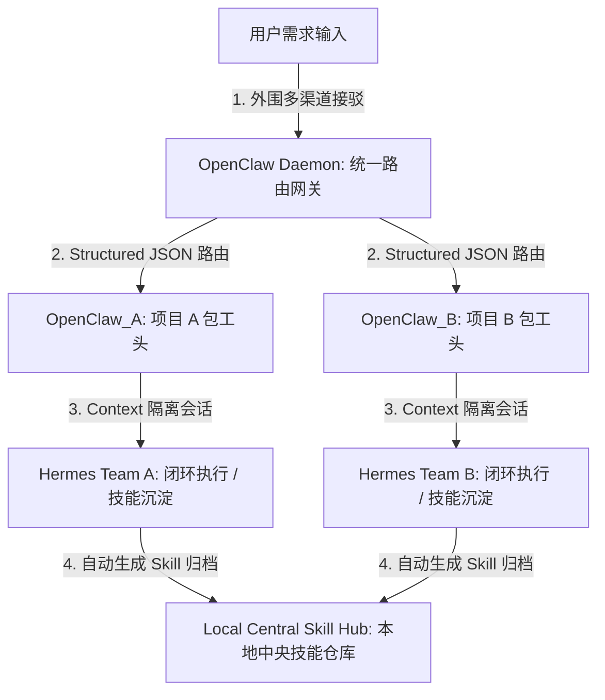

在 LLM 应用步入深水区后，单一智能体（Single Agent）在面对长上下文、多任务调度及复杂项目工程时，极易因 Context Exploding（上下文爆栈）与 Prompt 污染而走向崩溃。

为了在海量复杂任务中实现低资源保活与技能持续迭代，**分层多智能体（Hierarchical Multi-Agent）架构**正逐渐成为行业的主流演进方向。本文将探讨从极简底座选型到高阶 Token 降本的核心系统设计。

---

### 一、 Agent 运行时的三大流派

在选择多智能体底座时，需根据“资源占用”与“自我成长能力”两个维度对不同的 Agent Runtime 进行权衡：

```text
+-------------------------------------------------------------------------+
|                         Agent 运行时三大流派对比表                      |
+-------------------+-----------------------------------------------------+
| 极简内核派 (Rust) | ZeroClaw (<10ms 启动, <5MB 内存, 只负责调度, 不负责成长) |
+-------------------+-----------------------------------------------------+
| 操作系统派 (Python)| Nous Hermes (内置 SQLite 与多层 Memory, 自生成 Skill 复用)|
+-------------------+-----------------------------------------------------+
| 开箱集市派 (Go/TS)| OpenClaw (50,000+ 现成技能与可视化面板, 需防 CVE 安全注入)|
+-------------------+-----------------------------------------------------+
```

1. **ZeroClaw（极简内核）**：
   - 采用 Rust 编写，构建为单二进制文件。其极小的内存占用与毫秒级冷启动速度，使其天然适合作为大规模边缘执行器、NAS 监控节点或高并发的无状态路由网关。其底层逻辑是“只执行，不成长”。
2. **Hermes Agent（个人操作系统）**：
   - 由 Nous Research 团队主导，基于 Python+SQLite 架构。其核心亮点在于**多层持久化记忆（Layered Persistent Memory）与自发技能（Skill）生成机制**。
   - 在首次处理特定任务（如部署 FastAPI 服务）后，其内部的 Curator 模块会观察并识别用户操作习惯与网络环境，自动提取并沉淀为高度复用的自定义 Python 技能，以便未来直接调用，实现“越用越强”。
3. **OpenClaw（开箱集市）**：
   - 提供了极为丰富的对接渠道（Telegram、Slack、Web 面板）与庞大的第三方现成技能生态。但庞大的依赖树也引入了更高的系统攻击面与恶意插件安全风险。

---

### 二、 分层多智能体（Hierarchical）架构拓扑

在面对多项目并行的复杂业务时，最稳健的架构是将“外围渠道路由”与“长尾深度执行”进行解耦分离：



#### 1. 架构核心优势
- **隔离防止 Prompt 污染**：Project A 与 Project B 的 Hermes 执行团队分配在不同的通信通道中，上下文完全物理隔离，规避了混杂会话导致的指令篡改；
- **自演化降本**：当 Hermes 团队在特定项目内沉淀出高频技能（如 `deploy_fastapi_my_style()`）后，后续的重复执行将不再需要完整的规划推理，直接调用技能可实现 Token 消耗的对数级衰减。

#### 2. 通信协议与进程优化避坑
- **拒绝对话式转发，采用 Structured Schema**：层级之间严禁使用纯自然语言“传话”，否则会像“传话筒游戏”一样产生语义漂移。包工头与下游团队通信必须使用 JSON/Markdown Schema（包含 `Task_ID`、`Project_Scope`、`Expected_Output` 与 `Timeout`）；
- **降低多实例开销**：无需为每个 Project 启动独立的大型 Agent 进程。可利用 OpenClaw Daemon 内部的会话映射机制，直接将不同标签的消息抛给对应的本地 Hermes 频道。

---

### 三、 技能留存与 Token 膨胀的冲突优化

当 Agent 沉淀出成百上千个 Skill 时，如果将所有 Skill 的源码与说明都塞入 System Prompt，会导致上下文迅速膨胀，产生极高昂的背景 Token 费用。

为了解决“技能要无限留存”与“上下文要极致精简”的天然冲突，必须采用**“分级压缩 + 延迟加载”**的工程策略：

```text
+-------------------------------------------------------------------------+
|                  分级压缩与延迟加载 (Lazy Loading) 逻辑                 |
+-------------------+-----------------------------------------------------+
| 1. 会话剪枝       | 实时裁剪历史上下文, 保持主 Prompt < 2KB, 规避垃圾信息   |
+-------------------+-----------------------------------------------------+
| 2. 技能索引化     | 仅在 Prompt 中暴露: 技能名称 + 意图触发说明 (超高压缩)  |
+-------------------+-----------------------------------------------------+
| 3. 动态加载 (Lazy)| 只有大模型路由命中特定意图时, 才从 SQLite 动态读取源码执行  |
+-------------------+-----------------------------------------------------+
```

1. **会话剪枝与带外传输（Out-of-band）**：
   - 始终将主 System Prompt 严格约束在 2KB 以内。对于任务执行中产生的庞大文件、构建日志或大文本，绝不作为文本直接塞入对话，而是将其写入本地临时目录，仅在对话中传递**带外文件路径**，由 Agent 的本地工具直接读取。
2. **技能元数据索引化与延迟加载**：
   - 建立一个极其精简的技能索引列表。大模型在规划阶段，只能看到如 `{"name": "deploy_docker", "intent": "use this when user asks to run docker image"}` 的描述，单条仅占几十个 Token；
   - 只有当规划器明确返回调用 `deploy_docker` 时，系统底座才在运行时按需（Lazy Load）从本地 SQLite 中检索并加载对应的 Python 源代码并注入沙箱执行，实现**长尾技能无限留存且零日常背景 Token 占用**。
3. **中央技能同步与 API 缓存**：
   - 将各个子智能体团队生成的成熟技能，通过本地 Hook 自动同步到本地中央库（Local Central Skill Hub），实现跨项目知识共享；
   - 配合主流大模型 API 侧的 **Prompt Caching（提示词缓存）**，将高频固化的系统索引部分常驻缓存，使高频会话的首字延迟与开销降低 70% 以上。

---

### 结语

在多智能体系统的工程实践中，**“轻量级网关进行状态控制，重度运行时按需加载，自发进化技能以替代长推理”**，是兼顾架构美感与商业化资金效率（ROI）的终极解法。
