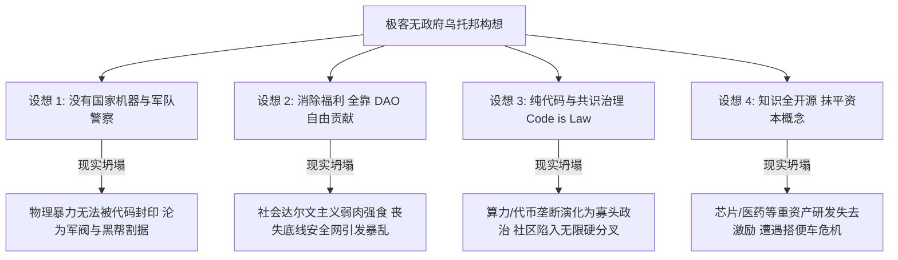

在 Web3、区块链与开源极客的世界里，经常激荡着一种极致的浪漫构想：**“打破一切国家与地域边界，依靠智能合约与 DAO 实现纯共识治理，知识全人类开源如 GitHub，抹平一切资本概念与国家暴力机构”**。

这套融合了无政府资本主义（Anarcho-Capitalism）与左翼共产主义（Anarcho-Communism）的乌托邦，描绘了一幅高度自治的美好图景。然而，当把这套模型置于政治哲学、经济学生产逻辑与人类数百万年文明演化的显微镜下，其内在的结构性坍塌便无可避免地显现出来。

---

### 一、 极客乌托邦的四重现实坍塌



1. **物理暴力的不可封印性**：
   - 智能合约可以约束数字资产的转移，但无法约束物理世界中的枪支、弹药与物理强制力。一旦国家机器对暴力的合法垄断（Monopoly on Violence）消失，物理世界的暴力真空会瞬间被拥有武装的私人安保、军阀或黑帮集团填补。
2. **共识治理退化为算力寡头政治**：
   - DAO 的治理权最终锚定在代币（Token）数量或算力贡献上。“去中心化”的表象下，持币巨鲸与算力垄断者迅速掌握绝对提案权与裁判权，形成无制约的寡头政治；面对重大人性利益冲突时，社区往往只能通过不可逆的“硬分叉（Hard Fork）”走向瓦解。
3. **重资产创新的激励断崖**：
   - 开源软件（如 Linux 内核、GitHub 生态）之所以能繁荣，底层高度依赖科技巨头商业资本的持续资金输血。对于半导体晶圆制造、尖端生物医药研发等需要上百亿美元沉没成本与数十年周期的领域，在没有产权保护与资本回报的“纯免费开源社区”中，将面临严重的“搭便车困境（Free-rider Problem）”而停滞不前。

---

### 二、 文明的真正起点：玛格丽特·米德与“愈合的股骨”

当极客乌托邦受挫，部分人容易倒向另一个极端——宣称“人类本质是动物世界，应当承认丛林法则与社会达尔文主义，老弱病残优胜劣汰很正常”。

人类学与考古学的发现，给出了最坚决的反驳：

```text
+-------------------------------------------------------------------------+
|                        人类文明诞生的第一个标志                         |
+-------------------------------------------------------------------------+
| 著名人类学家玛格丽特·米德 (Margaret Mead) 指出：在古人类遗址中发现的      |
| “一根愈合的股骨”，是人类文明真正的起点。                                 |
+-------------------------------------------------------------------------+
| 在动物界与残酷的荒野中，股骨骨折意味着丧失逃跑与觅食能力，必死无疑。    |
| 这根愈合的骨头证明：有人为伤者清洗包扎、提供食物并保护其免受野兽撕咬，  |
| 陪伴其度过了漫长的愈合期。                                              |
+-------------------------------------------------------------------------+
```

1. **反抗残酷自然才是文明的本质**：
   - 动物界的法则是“顺应”自然淘汰；而人类文明的本质——建造房屋御寒、研发抗生素抗病、建立社会救济网络，**全部是在利用制度与智慧“反抗自然的残酷”**。
2. **自然主义谬误（Naturalistic Fallacy）**：
   - 伦理学上，绝不能将“自然界客观存在的弱肉强食（Is）”，直接推导为“人类社会应当遵守的道德规范（Ought）”。
3. **老弱群体的隐性文明价值**：
   - 身体羸弱的智者（如霍金）贡献了最前沿的科学真理；老人的经验口传心授使族群跨越灾难。将人类价值狭隘定义为“野外体力优劣”，是彻底的蒙昧退化。

---

### 三、 无政府经济学与国家利维坦的人性张力

无政府经济学（奥地利学派/非侵犯原则 NAP）试图证明：**无需强制性国家，人类依靠私有产权、自发秩序与自愿契约也能实现繁荣**。

这一理论在哲学上极具自洽性，但它在面对真实世界时，触碰到了现代国家制度（利维坦）诞生的根本人性密码：

| 维度 | 无政府市场自发秩序 | 现代国家（利维坦）契约 |
| :--- | :--- | :--- |
| **对人性的假设** | 假设人具备高度理性、尊重契约与自愿利他 | 承认人性的短视、自私、贪婪与对暴力的恐惧 |
| **核心优势** | 彻底解放个人自由，消除公权力强制干预与剥夺 | 提供跨区域的统一信任底线、公共产品与安全庇护 |
| **致命代价** | 面对大规模陌生人社会，信任成本极高，极易滑向私斗 | 建立庞大官僚机器，通过税收与规训压抑个人自治 |

```text
[霍布斯的利维坦命题]
在没有公共权力震慑的自然状态下，所有人对所有人的战争导致生活“孤独、贫困、卑污、残忍和短寿”。
人类最终选择让渡部分自治权利给国家，不是因为国家完美，而是为了规避绝对混乱这一最大恶（Lesser Evil）。
```

---

### 结语

从数字世界中的 DAO 治理实验，到人类学远古遗迹中的愈合股骨，历史反复证明：

技术可以重塑契约的载体，算法可以提升协作的效率，但**代码无法替代人性的伦理，自发秩序无法脱离物理基础设施的依托**。

承认国家的制度局限并时刻警惕公权力的异化，同时坚守对弱者保护与文明秩序的底线，是人类在理想主义与残酷现实之间，所能维持的最清醒的平衡。
