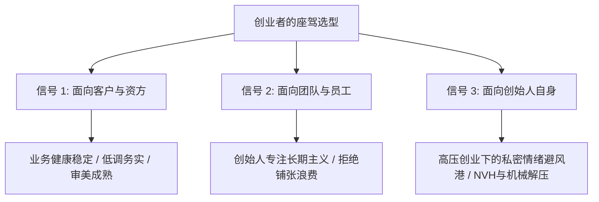
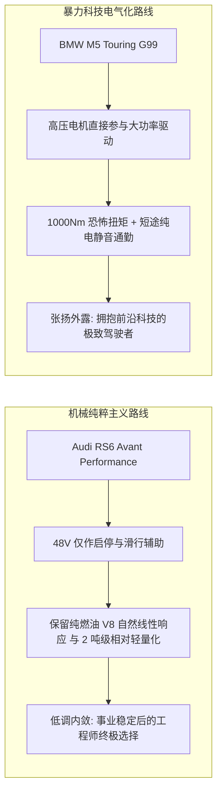

对于 40+ 的中年技术创业者而言，选车早已超越了单纯的“日常代步”或年轻时的“马力炫耀”。它本质上是一个**集商业信任背书、团队信号传递、资金折旧效率与个人精神避风港于一体的复合决策模型**。

为什么越来越多的工程师型创始人会本能地拒绝满街跑的“56E”行政模板？为什么中国商务社交对德系与美系存在着截然不同的心理锚定？在高性能旅行车（瓦罐）的终极殿堂里，奥迪 RS6 Avant 与宝马 M5 Touring 又各自代表了怎样的生活哲学？

---

### 一、 选车的底层逻辑：一个精密的三维信号系统



1. **对客户：降低商业解释成本**
   - 展现公司运营稳健，但切忌过度浮夸。在严肃的 B 端、政企或硬科技合作中，开一辆高调的大排量超跑或过于花哨的跑车，极易在资方与客户面前传递出“资金链太充裕/不务实/乱花钱”的负面杂音。
2. **对自身：中年男人的情绪安全屋**
   - 创业伴随着巨大的不确定性与心理负荷。晚上下班后在车库里多坐十分钟、深踩一脚油门时发动机的线性拉扯与底盘的沉稳沟通，是极高价值的心理减压阀。

---

### 二、 拒绝“56E”：从众模板 vs 懂车者的暗号

传统的“56E”（宝马 5 系、奔驰 E 级、奥迪 A6L）是中国商务市场最标准的从众模板。其传递的潜台词是**“我要让所有人一眼看出我是个老板”**。

而以奥迪 Avant / allroad / RS 系列为代表的性能瓦罐拥趸，其心理诉求截然不同：**“我不需要向外界证明什么，但懂车的人自然知道我是谁”**。

```text
+-------------------------------------------------------------------------+
|                        不同车型在创业社交中的气场对照                   |
+-------------------+-----------------------------------------------------+
| 传统 56E 行政轿车 | 商务不出错，但缺乏个性标签，易陷入中庸同质化        |
+-------------------+-----------------------------------------------------+
| 美系二线 (林肯/凯迪)| 以价换量打碎溢价，保值率惨淡，带有“二线折衷”标签  |
+-------------------+-----------------------------------------------------+
| 玛莎拉蒂 / 阿尔法  | 声浪/操控顶级，但商业评价两极化 (浮躁)，维修时间成本高|
+-------------------+-----------------------------------------------------+
| 德系高性能旅行车   | 工程师审美、懂得克制、兼顾家庭与极致性能的成熟符号  |
+-------------------+-----------------------------------------------------+
```

- **美系豪华的叙事困境**：林肯（Lincoln）与凯迪拉克（Cadillac）拥有极佳的直道大沙发舒适度与厚道配置，但因多年来终端大幅降价“以价换量”，打碎了豪华溢价，在二手市场上保值率惨淡；
- **意式个性的代价**：玛莎拉蒂总裁（Quattroporte）拥有迷人的法拉利血统 V6/V8 声浪，但在传统行业客户眼里容易被贴上“享受型/浮躁”标签；阿尔法·罗密欧（Giulia 四叶草）操控虽称神，但极窄的服务网络与动辄数月的修车等件周期，对时间就是金钱的创业者而言是灾难。

---

### 三、 终极宿命对决：Audi RS6 Avant vs BMW M5 Touring

在高性能旅行车的最高峰上，奥迪 RS6 与宝马 M5 Touring（G99）代表了两个时代的机械哲学分野：

| 核心维度 | Audi RS6 Avant Performance | BMW M5 Touring (G99) |
| :--- | :--- | :--- |
| **动力形式** | **4.0T V8 双涡轮 + 48V 轻混 (MHEV)** | **4.4T V8 双涡轮 + 高压插混 (PHEV)** |
| **综合输出** | 630 hp / 850 Nm | **727 hp / 1000 Nm** |
| **整备质量** | **~2,090 kg（车身相对轻盈）** | ~2,510 kg（背负 18.6kWh 大电池，超 2.5 吨） |
| **驱动灵魂** | 机械托森 Quattro 全时四驱 + 后差速锁 | M xDrive 智能四驱（可切纯后驱漂移） |
| **驾驶质感** | 贴地巡航、全天候全地形稳健、线性声浪 | 瞬间电感爆发、过弯极限极高但惯性与重量感明显 |
| **气质隐喻** | **穿羊毛大衣的高速巡航工具** | **穿定制西装开赛道方程式** |



- **Audi RS6 Avant** 的核心魅力在于其**克制与纯粹**。它的 48V 轻混不干预动力输出，没有高压大电池带来的 800 斤沉重负担。在懂车的人眼里，它是一辆兼顾全家出行与山路攻弯的“西装暴徒”；在不懂车的客户眼里，它只是一辆低调沉稳的奥迪旅行车。
- **BMW M5 Touring** 则是插电混动性能时代的暴力杰作。727 马力的恐怖数据与短途纯电静音穿行园区的优雅，满足了追求最新硬核科技的创始人对绝对力量的渴望。

---

### 结语

车是人内心地理与价值取向的物理延伸。

在充满喧嚣与博弈的商业世界里，选择一辆既能在谈判桌前为你赢得无声的尊重、又能在深夜归途给你提供纯粹机械慰藉的座驾，是中年技术创业者对自我生活最成熟的犒赏。
