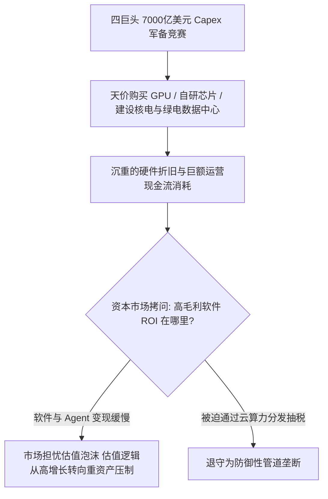

在生成式 AI 狂飙数年之后的 2026 年，科技巨头（Microsoft、Amazon、Google、Meta）的真实处境呈现出一种极度撕裂的戏剧性：一方面，各大厂在财报电话会上高呼 AI 转型，资本支出（Capex）合计飙升至惊人的 7000 亿美元以上；另一方面，在前沿通用大模型（AGI）的真正角斗场上，老牌巨头们却显露出疲态与被动，正悄然进行一场**从“前沿颠覆者”向“底层卖铲人”的战略退守**。

---

### 一、 Gemini 的失血与 Google 的战略退守

作为拥有 Transformer 论文原始发明权与顶级算力储备的巨无霸，Google 在这一轮 AI 浪潮中的演进轨迹极具警示意义：

```text
+-------------------------------------------------------------------------+
|                        Google AI 战略的退守路径                         |
+-------------------+-----------------------------------------------------+
| 顶尖人才失血      | 核心科学家出走 OpenAI/Anthropic，产品线收缩          |
+-------------------+-----------------------------------------------------+
| 内部博弈转向      | GCP 谷歌云主管胜出 -> 优先向 Anthropic 等租售 TPU 算力 |
+-------------------+-----------------------------------------------------+
| 商业定位迁徙      | 从“争夺前沿第一大模型” -> 退守为“万亿级云基础设施供应商” |
+-------------------+-----------------------------------------------------+
```

1. **核心科研力量的流失与产品线动荡**：
   - 伴随高层架构调整，大量奠定现代深度学习基础的顶尖科学家转投 OpenAI、Anthropic 或独立创业。从 Gemini 3.5 Pro 的规划调整到过渡版本在各项评测中的表现，自研前沿模型在事实层面已从领跑位置滑落。
2. **商业逻辑的现实主义转向：卖算力优于做模型**：
   - 在 Google 内部的路线博弈中，以 Thomas Kurian 为代表的谷歌云（GCP）业务赢得了最高话语权。Google 逐渐将重心转向利用自研 TPU 芯片构建超级算力集群，并将其大规模租售给 Anthropic 等第三方竞争对手，以此锁定每年数百亿至上千亿美元确定性的云服务与硬件营收。

---

### 二、 7000 亿美元 Capex 豪赌下的 ROI 焦虑

四巨头（MAGA: Microsoft, Amazon, Google, Meta）在 2026 年合计投入了超过 **7000 亿美元** 的资本支出（Capex），同比暴涨 70% 以上，全力兴建超级数据中心、抢购英伟达 Blackwell 架构芯片并铺设专有电力设施。



然而，资本市场正在对这场疯狂的“算力军备竞赛”重估风险：
- **重资产硬件折旧对现金流的侵蚀**：购买高端 GPU 与建设跨代级数据中心的投入是实打实的巨额真金白银，且芯片面临 3~4 年一代的快速折旧；
- **高毛利软件转化的滞后**：除了基础的云租售与开发 API 账单，面向终端消费级与企业级高客单价的 Killer App（如真正替代人力的自主智能体）仍处于商业化早期。万亿级基础设施投入与实际软件毛利之间的鸿沟，直接引发了资本市场对巨头估值逻辑的重塑。

---

### 三、 大企业病与“创新者的窘境”

巨头之所以在前沿模型演进中落入被动，本质上受制于克里斯坦森笔下经典的**“创新者窘境（The Innovator's Dilemma）”**：

1. **自我革命的恐惧（搜索广告的诅咒）**：
   - Google 最早拥有强大的对话式模型原型（如 LaMDA），但因极度担心直接给出精准答案的 Chatbot 会颠覆其赖以生存的“搜索引擎关键词竞价广告”利润奶牛，长期在产品化上犹疑不决，最终被没有任何历史包袱的 OpenAI 抢占了先机。
2. **合规、跑分与组织内耗**：
   - Meta 陷入了追求学术 Benchmark 刷榜与欧美严苛反垄断/隐私合规审查的双重泥潭，发布节奏迟缓；
   - 微软虽然深度绑定 OpenAI，但自身在 Copilot 企业级落地上的体验割裂与多层中转，亦未能完全激发出原有 Office 帝国的绝对生产力跃迁。

---

### 四、 终局防线：防御性基础设施垄断

既然在前沿技术“从 0 到 1”的单兵突破上无法战胜更敏捷、更激进的初创 AI 实验室，四大巨头最终祭出了其在 PC 和移动互联网时代最熟悉的杀手锏——**通道与基础设施垄断**。

- **微软**：通过 Azure 锁定全球企业级 IT 渠道与 OpenAI 的独家云承载；
- **亚马逊**：依托 AWS 的全球最大云市场（Marketplace）与自研 Trainium/Inferentia 芯片，充当所有模型的算力收税中枢；
- **谷歌**：以 GCP 与 TPU 算力集群为底座，同时在底层 Android、Chrome 与 Workspace 中强行预装 AI 接口；
- **Meta**：利用开源 Llama 打击闭源对手的软件溢价，同时以每年数百亿美元的广告净利润为 AI 研发持续输血。

---

### 结语

AI 时代的权力交接并没有如预想般迅速“摧毁旧巨头”，但它无情地戳破了巨头作为“全知全能创新灯塔”的神话。

四大巨头或许不再能代表人类算法的最前沿，但凭借 7000 亿美元筑起的算力与电力高墙，它们成功将自己转型为整个 AI 时代不可绕过的**“终极数字地主与水电公用事业公司”**。这场关于智能与资本的战争，正从浪漫的科学探索，彻底演变为冷酷的重资产消耗战。
