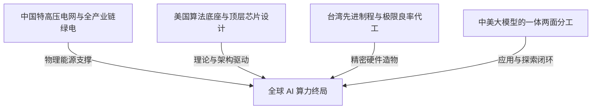

在全球科技与地缘政治加速重构的当下，人工智能的竞争早已超越了单纯的代码演进与学术比拼，演化为一场横跨能源、精密制造、底层理论与国家体制的深层博弈。未来数十年内，全球硬科技产业正被焊接成一个高度共生却又充满张力的“四角铁幕”。

---

### 一、 不可突破的全球硬科技“四角铁幕”

无论政治强权如何试图推动制造业回流，亦或行业领袖如何进行垂直整合，物理定律、产业历史积淀与地缘禀赋构筑了难以撼动的四大支柱：

1. **中国的能源底座**：大模型向通用人工智能演进的终极瓶颈是电力。中国拥有全球规模最大的特高压输电网络、全产业链的光伏风电配套以及核电火电基建。美国受制于土地私有化与审批周期，跨州电网翻新极度缓慢。大规模绿电与能源低谷的客观现实，构成了 AI 算力中心不可逾越的物理底座。
2. **美国的芯片设计与算法源头**：从英伟达 CUDA 生态、AMD/苹果/谷歌的先进制程架构设计，到 Transformer 乃至下一代 AGI 架构，美国依托高校科研体制与风险投资网络，牢牢把握着从 0 到 1 的理论探索与基础软硬件定义权。
3. **台湾的芯片代工奇迹**：台积电（TSMC）2nm 及以下先进制程并非简单的厂房搬迁即可复制，其背后是数十万顶级工程技术人员在高压工程师文化、微米级良率把控与上下游密集配套中打磨出的制造奇迹。
4. **中美大模型的一体两面**：美国主导颠覆式基础架构的前沿突破（从 0 到 1），中国则依托庞大的工程师红利与市场场景，将技术迅速工程化、极致压缩推理成本并融入千行百业（从 1 到 10000）。

---

### 二、 从 0 到 1 vs 从 1 到 10000：体制培养皿的冷思考

关于技术创新的分工，产业界最核心的共识在于：**颠覆式探索依赖宽松容错的创新土壤，而工程化内卷依赖严苛高效的执行机制。**

- **为什么颠覆式创新（0 到 1）集中在硅谷？**
  OpenAI 早期数年不计商业回报的纯粹探索、谷歌科学家发表 Transformer 架构，源于其科研文化允许极少数探索者追求短期无法变现的未知方向，并享有跨越周期的资本耐心与全球无边界的数据流动。
- **为什么极限性价比突破（1 到 10000）在中国爆发？**
  以 DeepSeek、Qwen 为代表的团队，在既定技术范式确立后，能够以极致的数学优化、MoE 架构创新和算力调度技巧，将训练与推理成本压缩至数十分之一，完成向消费级与工业级场景的大规模普及。

---

### 三、 硅谷大模型底层的“华人基石”

一个常被忽视的底层真相是：**支撑美国 AI 从 0 到 1 突破的核心技术力量中，华人科学家与工程师占据了极其庞大的比重。**

- 在 OpenAI 核心研发成员（如 Ilya Sutskever 的关门团队）、Meta FAIR/Llama 核心架构组、谷歌 DeepMind 以及英伟达硬件架构研发团队中，毕业于清华、北大、中科大等顶尖学府并赴美深造的华人工程师比例普遍超过 30% 至 50%。
- 这一现象证明：决定创新形态的并非智力基因，而是**体制培养皿**的差异。同一批卓越的头脑，置于以容错与自由探索为主的创投环境中，激发的是颠覆式的理论突破；置于以 KPI 和确定性考核为主的环境中，激发的则是极致的工程与成本内卷。

---

### 四、 李飞飞与空间智能：学术与商业的双重祛魅

作为计算机视觉领域的先驱，李飞飞（Fei-Fei Li）的学术轨迹与近期创立的 World Labs，折射出 AI 发展史上的路径探索与资本叙事逻辑。

#### 1. ImageNet 的奠基逻辑：数字人海战术的战略定力
2007 年全球顶尖学者普遍执迷于小样本精细特征算法时，李飞飞顶住学界质疑，通过亚马逊 Mechanical Turk 众包 5 万名网民清洗标注 1400 万张图像。ImageNet 虽属于数据层面的重度工程工作，但正是这一战略定力，为 2012 年 AlexNet 的爆发铺设了最关键的基石。

#### 2. 认知神经融合：仿生的“先烈”与多模态的“先驱”
- **认知仿生的局限**：早期试图通过贝叶斯单样本等人类认知机理让机器理解图像的尝试，最终被现代深度学习的大数据统计与算力暴力美学所覆盖。
- **多模态的奠基**：其与学生 Andrej Karpathy 在 2015 年发表的 Image Captioning（图像语义对齐）论文，首次打通了卷积网络（CNN）与循环网络（RNN）的界限，成为今日 GPT-4o、Claude 等多模态模型“看图识物”的核心技术先驱。

#### 3. 空间智能（World Labs）的资本叙事
在纯文本与二维图像大模型遭遇数据墙与推理天花板的背景下，World Labs 主打的“空间智能”（三维物理世界认知）在数月内估值突破 10 亿美元。这既是硅谷资本为了寻找具身智能（Robotics）下一个叙事出口的集中押注，也带有浓厚的概念先行色彩，其能否转化为真正的生产力颠覆，仍有待工程与物理落地检验。

---

### 五、 结语

未来的全球科技版图，将继续在这一套坚硬的四角铁幕下运转。无论是能源的物理制约、芯片制造的极限良率，还是算法探索与工程优化的共生，没有单一方能够完全脱离全球协作而独善其身。认清体制与禀赋的客观边界，远比盲目的地缘口号更具现实意义。
