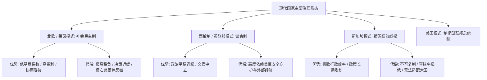

在探讨现代国家制度时，公众往往容易陷入两种极端的认知误区：要么简单地以“民主 vs 专制”标签化不同政体，要么盲目推崇某种看似完美的制度模板（如北欧福利模式或新加坡高效模式）。

然而，比较政治学的核心规律表明：**世界上不存在任何一种超越时空、普适且绝对的“最先进制度”**。任何制度都是特定人口规模、地缘安全、历史文化与经济禀赋约束下权衡（Trade-offs）的结果。

---

### 一、 表面名义与实质逻辑：美俄体制的深层分野

美国与俄罗斯名义上均属于“联邦共和制”，但在权力的实际流动与制衡机制上，呈现出截然相反的运行生态：

```text
+-------------------------------------------------------------------------+
|                         美俄实质运行体制对照表                          |
+-------------------+-----------------------------------------------------+
| 美国模式 (USA)    | 严格三权分立 + 两党轮替极化博弈 + 50州宪政深度分权  |
+-------------------+-----------------------------------------------------+
| 俄罗斯模式 (RUS)  | 强人统治 + 垂直权力体系 (Power Vertical) + 竞争性威权|
+-------------------+-----------------------------------------------------+
```

1. **美国：制度化分权与对抗制衡（Checks and Balances）**
   - 总统掌管行政权，但受制于国会的立法拨款权与最高法院的司法违宪审查；
   - 联邦宪法第十修正案确立了州权原则，50 个州拥有独立的司法、税收与警察体系。对集权和暴政拥有最强的天然防御力，但也承受着两党极化导致的立法僵局。
2. **俄罗斯：垂直权力体系与超级总统制（Super-Presidentialism）**
   - 1993 年宪法确立了行政权独大的制度框架。总统拥有任命政府首脑、签发法律效力行政命令乃至解散杜马的权力；
   - 通过取消地方长官直选、建立“垂直权力体系”，地方自治权被大幅回收，形成了事实上的威权集权与指令型治理。

---

### 二、 现代主要治理模式的优势与代偿边界



1. **北欧/莱茵社会民主制（丹麦、挪威、德国、荷兰）**：
   - 依托比例代表制与多党联合执政，保障了极高的社会福利与极低的腐败率；
   - 但其运转高度依赖“小国寡民、人口同质化、高社会信任度”的土壤。当面对难民危机、人口老龄化与外部地缘冲突时，冗长的联合组阁与内部扯皮暴露出决策效率低下的硬伤。
2. **新加坡精英绩效治理**：
   - 在城市国家尺度上实现了极致的商业效率、廉洁度与法治环境；
   - 但其高度依赖顶层精英的个人操守与单一政党统治，社会政治自由度受限，且在千万级以上人口的大国中完全不可复制。

---

### 三、 政治学中的“治理不可能三角”

衡量一个制度的有效性，往往必须在以下三个天然冲突的维度中做艰难取舍：

```text
                    【决策与执行效率】
                    (如：新加坡 / 集权模式)
                     /          \
                    /            \
                   /              \
                  /                \
    【社会包容与多元自由】 ---------- 【系统稳定性与防暴政】
     (如：北欧 / 荷兰)                 (如：美国 / 瑞士)
```

- **追求绝对制衡**（如美国），必然牺牲政府的即时决策效率，面对系统性痼疾（如医保、枪支）难以根治；
- **追求极致效率**（如新加坡），必然削弱对公权力的制衡监督机制，将国家前途押注于少数精英；
- **追求多元包容**（如荷兰多党制），议会必然碎片化，极易陷入多党扯皮与微小极端党派的勒索绑架。

---

### 四、 维度解耦：联邦共和制 vs 社会民主制

公众经常将“联邦共和制不如社会民主制”作为比较命题，但在政治学范畴中，这是**典型的跨维度概念错位**：

| 维度 | 概念分类 | 核心回答的问题 | 典型要素 |
| :--- | :--- | :--- | :--- |
| **政体维度** | **联邦共和制** | **国家公权力如何划分与架构？** | 中央与地方分权、三权分立、废除世袭君主 |
| **分配维度** | **社会民主制** | **国家奉行什么经济社会分配理念？** | 累进高税收、二次再分配、全民医保社保托底 |

这两者不仅不冲突，反而能衍生出丰富的制度组合：

```text
[组合 A: 联邦共和制 + 社会民主制 (如 德国)]
既通过 16 个联邦州分权防止中央独裁，又通过社会市场经济保障劳工权益与极低贫富差距。

[组合 B: 单一制 + 社会民主制 (如 瑞典 / 丹麦)]
中央政策自上而下传导极快，全民福利均质化覆盖，但极度依赖文化同质土壤。

[组合 C: 联邦共和制 + 自由资本主义 (如 美国)]
创新与风险投资活力冠绝全球，对大政府干预极度警惕，但社会撕裂与贫富分化严重。
```

---

### 结语

制度的先进性，从来不在于纸面宪法的辞藻，而在于其**能否在特定的历史地缘环境下完成自洽，并具备和平纠错与自我演化的韧性**。

脱离国家的人口规模、产业结构与地缘安全红利去空谈制度优劣，无异于刻舟求剑。
