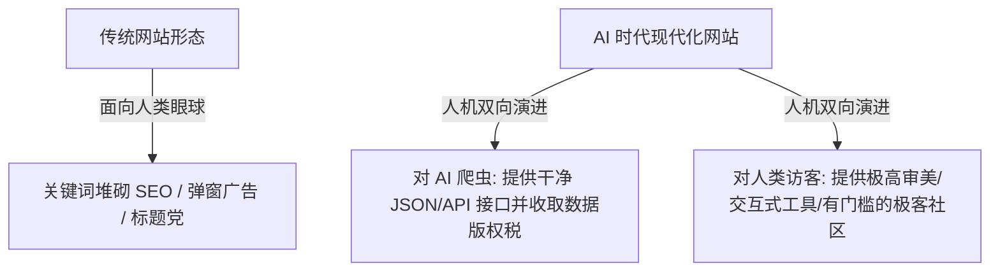

随着 ChatGPT、Claude 等大语言模型以及智能代理（AI Agents）重构了信息交互范式，一个频繁被提及的论调是：“既然所有问题都可以通过对话框直接获取答案，独立的网站（Website）是否正在走向消亡？”

然而，当我们深入观察现代极客社区（如 Linux.do）的逆势繁荣，并审视大模型底层对数据的严重依赖时，会得出一个截然相反的结论：**独立网站不仅不会死亡，反而正在成为对抗 AI 信息污染、抵御平台算法剥夺的最后避难所，以及维持整个 AI 智能体生态运转的“数字水源”。**

---

### 一、 Linux.do 的启示：数字特权外壳下的硬核极客圣地

在中文互联网充斥着算法推荐与水军噪声的当下，基于 Discourse 框架搭建的 **Linux.do** 社区展现出了极高的活跃度与独特的亚文化特征：

```text
+-------------------------------------------------------------------------+
|                      Linux.do 的社区分层与运作逻辑                       |
+-------------------+-----------------------------------------------------+
| 表面形态 (门槛)   | 严格邀请制 + 信任等级 (Trust Levels 0-4) + 极简极客 UI   |
+-------------------+-----------------------------------------------------+
| 内核价值 (输出)   | AI 逆向工程 (API/模型白嫖) + 自动化脚本容器化 + 拒绝伸手党 |
+-------------------+-----------------------------------------------------+
```

1. **“数字贵族”式的准入门槛**：
   - 采用严格的邀请码机制与信任等级制度（Connect Trust Levels 0 至 4），通过等级划分构筑了天然的防御边界；
   - 极简、无商业广告的 Discourse 界面与 `.do` 域名，在视觉与交互上确立了纯粹的极客身份认同。
2. **硬核价值维系的自治契约**：
   - 这种门槛之所以没有沦为空洞的自我感动，是因为其内部提供了极高密度的生产力与逆向资源：从顶尖 AI 模型（GPT-4o、Claude 3.5）的逆向 API 共享、多账号自动化池，到云厂商试用配额与算力脚本的 Docker 容器化打包；
   - 社区文化严厉排斥“纯伸手党”，要求高等级用户必须以硬核技术教程、开源代码仓或服务器节点作为履约凭证。这种机制使 Linux.do 成为古典黑客论坛在现代 AI 时代的精神转生。

---

### 二、 AI 的“数据荒”与模型近亲繁殖危机

大模型无法凭空创造原创知识，它们本质上是全网人类智慧的综合提炼者。大模型对独立网站的绝对依赖体现在两个致命维度：

#### 1. 数据枯竭与模型崩溃（Model Collapse）
当互联网充斥着由 AI 生成的平庸内容时，如果缺乏由人类撰写的原创博客、深度评测与垂直论坛，大模型将被迫以“AI 生成的数据”作为训练输入。这种“近亲繁殖”会导致模型在数学统计上迅速积累方差与幻觉，最终走向不可逆的**模型崩溃（Model Collapse）**。

#### 2. 独立网站是维系 AI 生命的“淡水系统”
人类在独立网站上记录的真实踩坑经验、小众硬件折腾日志、独特的代码实现，构成了源源不断注入互联网的“新鲜水源”。一旦独立网站消亡，整个 AI 模型的智力进化将彻底停滞。

---

### 三、 个人数字主权：对抗平台封号与算法剥夺

在中心化社交平台（微信公众号、抖音、小红书、X）上，创作者与用户处于绝对的从属地位：
- 平台的一个算法权重微调，可以让数年的流量积累瞬间归零；
- 一次无预警的封号，可以彻底抹去创作者在数字世界的全部数字资产。

**独立网站是数字世界中唯一真正属于你的“主权领土”**。只要站长按时续费域名并运行服务器，世界上没有任何单一商业实体能够强行下架你的文字、代码与思考。这种去中心化的韧性，是中心化社交平台永远无法替代的。

---

### 四、 Web 形态演进：从迎合人类眼球到“人机双向友好”

AI 并没有扼杀网站，而是像一把高压筛子，将过去靠洗稿、抄袭和堆砌 SEO 关键词生存的垃圾流量站彻底淘汰。未来的网站形态正在发生根本性重塑：



1. **从 SEO 到 LLMO（大模型优化）**：网站站长不再仅针对搜索引擎爬虫优化关键词，而是通过结构化数据规范，让 AI Agents 能够无缝解析、准确引用并注明版权来源。
2. **数据资产化与付费墙**：Reddit、Stack Overflow 等高价值社区已开启对大模型训练抓取的高额收费模式，独立网站的原创数据正转化为高价值知识产权（IP）。
3. **工具化与沉浸感**：对于人类用户，网站正从单纯的图文阅读器进化为高审美、带微交互的个人数字工作室（Digital Garden）与独立 SaaS 工具。

---

### 结语

在 AI 生成内容泛滥成灾的未来，真实的人类体验与独立思考将变得前所未有的稀缺与昂贵。

独立网站不仅不会消亡，它将作为人类思想的防伪证书、抵御平台霸权的数字城堡，以及对抗大模型熵增的终极避风港，长久地伫立在互联网的版图之中。
